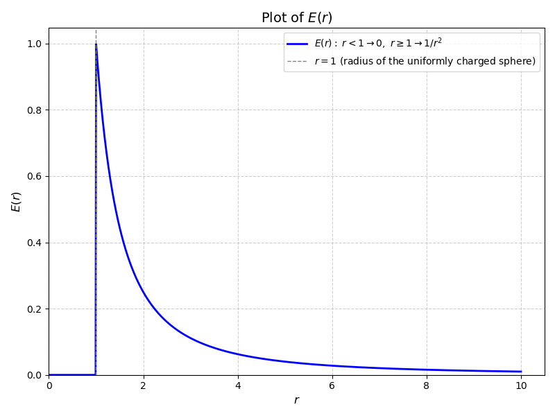

> [!link] Back to main website
> [Home](https://comphy-lab.org/), [Team](https://comphy-lab.org/team), [Research](https://comphy-lab.org/research), [Github](https://github.com/comphy-lab)

# Gauss law of electrostatics

> [!significance] Metadata
> Author:: [Vatsal Sanjay](https://vatsalsanjay.com) 
> Date published:: Jan 21, 2025 
> Date modified:: Jan 21, 2025 at 04:08 CET

> [!important] Pre-requisites 
> I assume a working knowledge of 
> * Electric field $\vec{E}$.
> * [[Geometric description of electric field]]
> * [[What is electric field flux?]]
> * What is the electric field created by a point change $q$? 
> $E = q/(4\pi\varepsilon_0r^2)$
> * [[Principle of superposition of electric fields]]
 
---

## Question we ask: which of the following three surfaces will see the maximum flux of $\vec{E}$ pass through itself?

Fig. A cone, a sphere, and a batman symbol (enclose it in the front and the back) encircle a lonely charge of magnitude $q$. Which of the three will experience maximum eleectric field flux passing through them? This is perhaps the most counterintuitive result of the Gauss law. 

> [!question] Try it yourself
> Instead of taking my (well, Gauss') word for it, try finding the flux through the cone and the circle by integrating the dot product of the local electric field and the area (note that for cone, we must account for both the lateral and the base area). Once you find the solution, make a PR at the GitHub repository please show all intermediate steps. 

## General form of Gauss' law

> [!tldr] Main statement of Gauss' law
> The flux of electric field $\vec{E}$ though a closed surface (known as the Gaussian surface) is equal to the amount of change enclosed by that surface. $\int_A\vec{E}\cdot\vec{n}dA = q_{\text{in}}/\varepsilon_0$, $\vec{E}$ is the electric field, $n$ is the normal vector to the area element $dA$, $q_{\text{in}}$ is the change enclosed inside the Gaussian surface and $\varepsilon_0$ is the [[permittivity of free space]].
> * In the differential form, it is identical to:
> $\vec{\nabla}\cdot\vec{E} = \rho/\varepsilon_0$, where $\rho$ is the local electric changed density. 

Let us define the flux as:
$$
\Phi = \int_A\vec{E}\cdot d\vec{A} = \int_A\vec{E}\cdot \hat{n}dA
$$

Then, 
$$
\int_A\vec{E}\cdot \hat{n}dA = \frac{q_{\text{in}}}{\varepsilon_0}
$$

Of course, $q_\text{in}$ is

$$
q_\text{in} = \int_A\sigma dA = \int_V\rho dV,
$$
where $\sigma$ and $\rho$ are the surface and volumetric change densities, respectively. 

## Proof: 
> [!caution]
> I leave it upto you to decide if the following derivations are the proofs or merely consistency checks for the Gauss' law.
### Special case of spherical Gaussian surface enclosing a single charge: 

Electric field by a point change: 

$$ 
\vec{E} = \frac{q}{4\pi\varepsilon_0r^2}\hat{r}
$$

Flux through a sphere of radius $r$, 

$$
\Phi = E\hat{r}\cdot\hat{r}A = EA = \frac{q}{4\pi\varepsilon_0r^2}4\pi r^2 = \frac{q}{\varepsilon_0}
$$

### Arbitary Gaussian surface enclosing a single charge: 

Electric field by a point change: 

$$ 
\vec{E} = \frac{q}{4\pi\varepsilon_0r^2}\hat{r}
$$

Local flux at the indicated location:

$$
d\Phi = E\hat{r}\cdot\hat{n}dA  = \frac{q}{4\pi\varepsilon_0r^2}\cos\alpha\,dA = \frac{q}{4\pi\varepsilon_0}\frac{\cos\alpha\,dA}{r^2}
$$

Here, $\cos\alpha\,dA/r^2 = d\Omega$ is in fact the solid angle subtended by the local area element.

$$
\Phi = \int d\Phi = \int_\Omega\frac{q}{4\pi\varepsilon_0}d\Omega
$$

The solid angle $\Omega$ integrates to give $4\pi$ resulting in

$$
\Phi = \frac{q}{\varepsilon_0}
$$

---

## Consequences of Gauss' law

> [!danger] Displace the charge all you want, it won’t change the flux
> The flux of $\vec{E}$ only depends on the amount of charge contained inside a Gaussian surface and not on whether or not the charge is moving inside the space enclosed by this Gaussian surface.

**Remarkable property:** If charges are moved around **but do not cross** the boundary of **A**, the flux of **E** through **A** remains **unchanged**. Despite this unchanging flux, the field **E** itself can undergo substantial modifications everywhere else. Conversely, if charges **do** cross the boundary of **A**, the flux through **A** will generally change.

> [!danger] A charge outside the Gaussian surface imparts net zero flux in that control surface
> It is easier to see by construction that electric field lines coming out of a charge outside a Gaussian surface will pass straight through without creating any global flux. 

> [!danger] On the impossibility of equilibrium in electrostatics
In any electrostatic field, a charge cannot be in [stable equilibrium](https://en.wikipedia.org/wiki/Mechanical_equilibrium). 

A single point charge $q$ cannot remain in stable equilibrium under the electrostatic influence of other, fixed charges in vacuum. Can you think of a scenario? 
Say, we do. And now, let us enclose this $q$ within a small closed surface $A$. For $q$ to be in stable equilibrium, the net electric field from all other charges must point inward everywhere on $A$. Such an inward field is critical to create a restoring force for any small displacement of $q$. However, Gauss’s theorem tells us that the total electric flux through $A$ must be zero if no net charge (creating this electrostatic field) is contained inside $A$. This zero flux requirement forces the field to have both inward and outward components on the surface, contradicting the need for a purely inward field. Hence, no purely electrostatic arrangement of external charges can hold a point charge in stable equilibrium in a vacuum.

## Symmetries to the rescue
### Plannar symmetry

Consider an infinite sheet with uniform surface‐charge density $\sigma$. By symmetry, the electric field must point perpendicular to the sheet and have the same magnitude on either side (left-right symmetry).  Select a "pillbox" (a short cylinder) that straddles the sheet as your Gaussian surface.  The flux then emerges through the two circular faces only; there is no flux through the curved surface because $\vec{E}$ is parallel there.  The integral form of Gauss’s law yields

$$
2\,E\,A \;=\; \frac{\sigma\,A}{\varepsilon_0}
$$

$$
\quad\Longrightarrow\quad E \;=\; \frac{\sigma}{2\,\varepsilon_0}.
$$

Hence, an infinite charged plane produces a constant electric field whose magnitude depends solely on $\sigma$.

#### Special case:

![[plates.png]]

When **two** parallel sheets carry equal and opposite surface‐charge densities $+\sigma$ and $-\sigma$, superposition implies that the fields from each sheet **add** in the region between them and **cancel** outside.  Specifically, in the space between the plates, each sheet contributes $\sigma/(2\,\varepsilon_0)$ in the **same** direction, giving a total

$$
E_{\text{between}}
\;=\;
\frac{\sigma}{\varepsilon_0}.
$$
  
Outside the plates, the fields from the two sheets have opposite directions and thus cancel to zero, assuming the plates are large compared to their separation. This configuration approximates the uniform field of a parallel‐plate capacitor.

### Cyliindrical symmetry

Consider an infinitely long wire with a uniform linear charge density $\lambda$.  By symmetry, the electric field $\vec{E}$ at distance $r$ from the wire must point radially outward and have constant magnitude on a coaxial cylindrical surface of radius $r$.  Let us choose this coaxial cylinder as our Gaussian surface (length L).  The flux is through the curved surface only; both end caps see $\vec{E}$ parallel to their planes and hence yield no net contribution.  Applying Gauss’s law,

$$
E \,(2\pi r L)
\;=\;
\frac{\lambda\,L}{\varepsilon_0}
$$

$$\quad\Longrightarrow\quad
E \;=\; \frac{\lambda}{2\pi \varepsilon_0\,r}.
$$
  

The field diminishes as $1/r$ from the wire.

### Spherical symmetry

Here, let us consider two cases: 1. uniformly charged sphere with charge density $\rho$ and 2. a thin spherical shell with change $q$. Both have a radius of $a$. Also, assume $\frac{4\pi a^3}{3}\rho = q$. 

#### For $r > a$:
Here, the Gaussian surface contains the entire spherical object inside it. So, in both cases, the Gaussian surface sees a total charge of $q$. 

Consequently, 

$$
E = \frac{q}{4\pi\varepsilon_0r^2}
$$

#### For $r < a$:

* *Shell:* Charge enclosed inside the shell for $r<a$ (assuming infinitely thin shell) is $0$. So, $E = 0$.

So, the final result for shell is 

* *Uniformly changed sphere:*
For uniformly charged sphere, 

$$
\Phi = E(4\pi r^2) = \frac{\rho}{\varepsilon_0}\frac{4\pi r^3}{3}
$$

Substituting, $\rho = 3q/(4\pi a^3)$:

$$
E(4\pi r^2) = \frac{qr^3}{a^3\varepsilon_0}
$$

$$\quad\Longrightarrow\quad 
E = \frac{qr}{4\pi\varepsilon_0a^3}
$$

So, the final result for uniformly charged sphere is

## A critique of the Gauss' law in the non-local form

### Illusion of Generality
The integral form,

$$
\int_A \mathbf{E} \cdot d\mathbf{A} = \frac{q_\text{in}}{\varepsilon_0},
$$

can give a misleading impression that it solves _any_ electrostatic field problem elegantly. While it is indeed general as a statement of charge–field relationships, _practical_ usage relies heavily on symmetry arguments to simplify the surface integral.

### Dependence on Symmetry

Gauss’s integral theorem is most effective when the field and geometry exhibit high symmetry (e.g., spherical, cylindrical, or planar). In such cases, one can choose a closed surface $A$ where the electric field $\vec{E}$ is either constant in magnitude or zero over different parts of the surface. This makes the flux integral collapse to a simple multiplication, thus giving a direct link between enclosed charge and field magnitude.

### Limitations in Complex Geometries

For configurations lacking these symmetries—such as a uniformly charged disk or other irregular charge distributions—no straightforward closed surface simplifies the flux integral. In these scenarios, one must resort to more laborious methods, like direct integration of Coulomb’s law or employing the local (differential) form combined with suitable boundary conditions.

## Some food for throught 

Gauss' law is agnostic to the number of dimensions in the problem. In this note, we mainly looked at cases in 3D. Now, think about living in a 2D space. Answer the following: 

1. How does the Coulomb's law change in 2D?
2. Adapt Gauss’s law to a 2D problem, where **flux** becomes a line integral around a closed loop. Consider a point charge qqq in a 2D plane. Choose a circle of radius $r$ around the charge as the "Gaussian" boundary. Compute the total radial component of $\vec{E}$ along this circle and show that it is proportional to $q/\varepsilon_0$ (with an appropriate constant reflecting 2D geometry).
3. For a hypothetical "4D" space, the electric field of a point charge might scale differently with distance. Use dimensional analysis to argue how Gauss’s law might look there, and what the "closed surface” would mean in 4D. **Hint:** Highlight the dimension-agnostic idea that flux = enclosed charge/$\varepsilon_0$​ remains structurally the same, although radius-dependencies of $\vec{E}$ and definitions of "surface" change with dimension.

**Note:** To submit answers to the questions above or in case you find a mistake in this note, please feel free to open a pull request at the repository: [link to repository](https://github.com/comphy-lab/CoMPhy-Lab-Blogs).

---
> [!testy] Some side notes:
> * To explore some history, see: [[History-of-Gauss]]
> * Here, we discuss a lot about Gaussian surfaces. The fluid dynamicist in me cannot help but point out that a [[Gaussian surface is very similar to the control volume in fluid mechanics]]. 💡
---