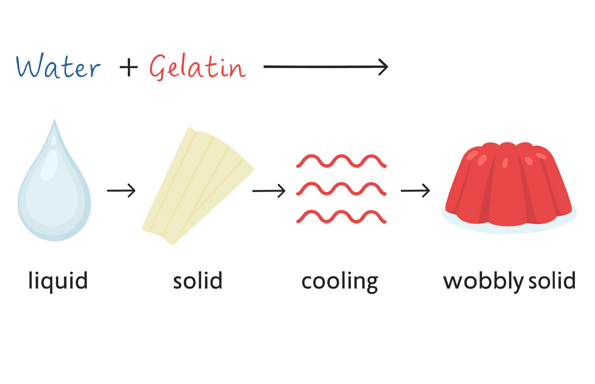
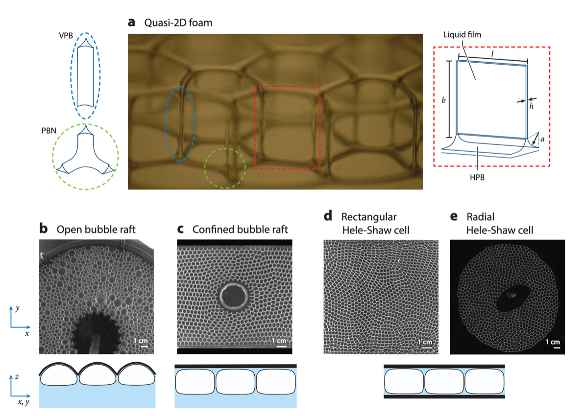
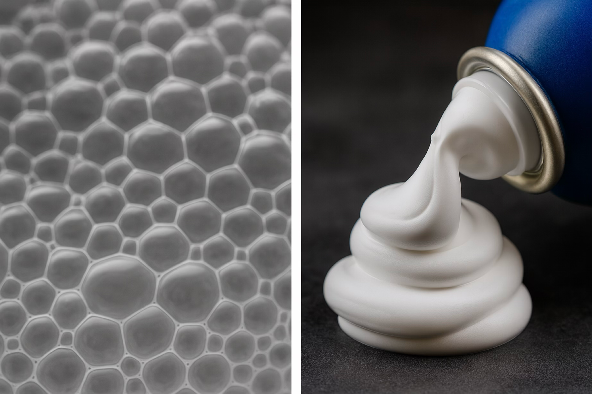
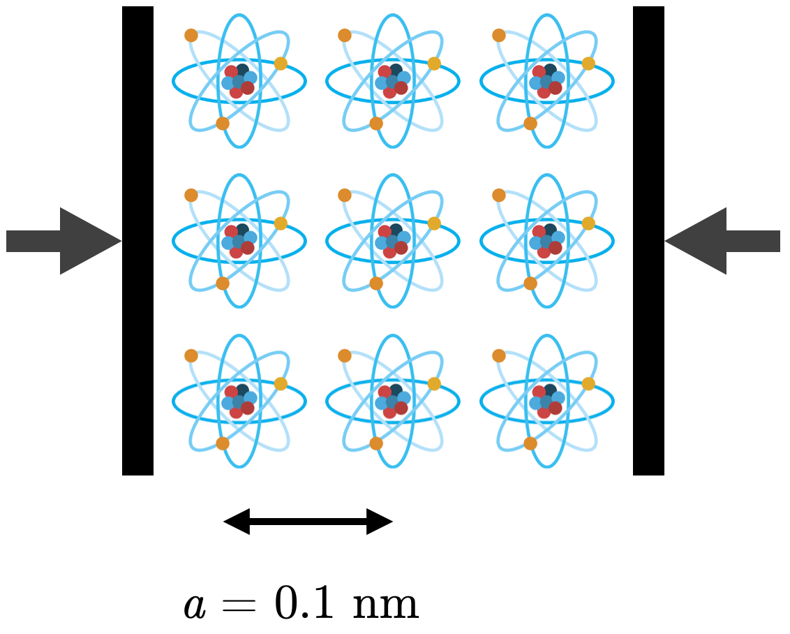
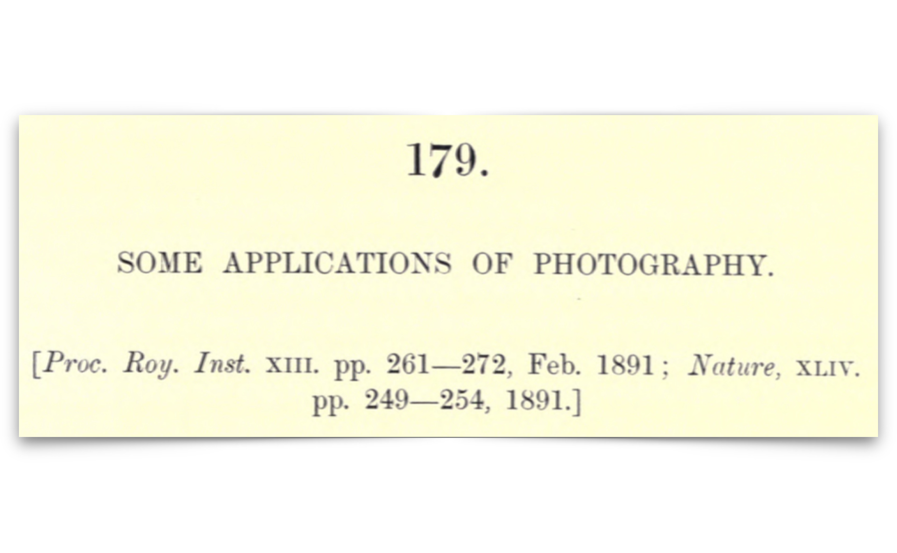
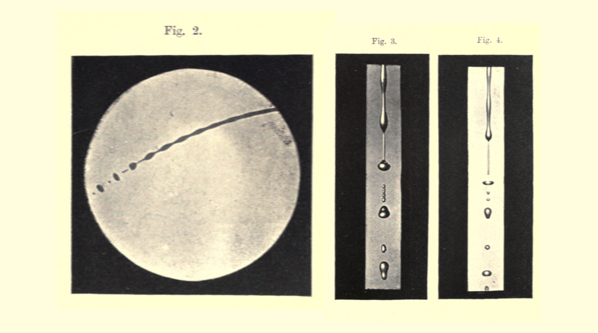
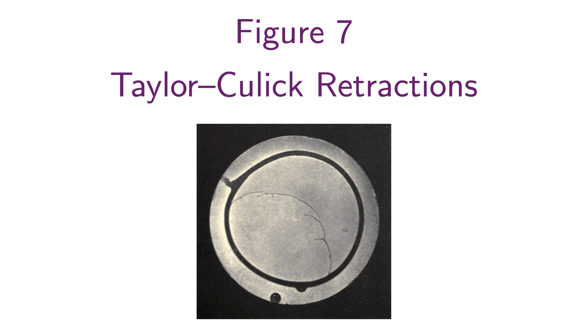

# Lecture 1: Different Faces of Soft Condensed Matter

An introduction to soft materials, why they're soft, and how we measure softness. See [[0-README|course overview and structure]] for context.

---

## Prologue: Opening Poll

> [!question] "Name one soft material you've touched today."

Soft matter is everywhere in daily life—from the water in your shower and shampoo to the bread on your table, tissues, foams, and gels. This simple question anchors a deeper truth: the materials we interact with most are soft.

---

## What is Soft Matter?

> [!tldr] Definition
> Materials easily deformed by modest stresses, thermal fluctuations, or interfacial forces; typically organized by mesoscopic building blocks (droplets, bubbles, grains, polymer coils) held together by relatively weak interactions.

### Everyday Snapshots

#### Water + Gelatin → Gel

Observe the transformation of gelatin and water:

- Liquid state: Individual molecules move freely
- Cooling: Gelatin chains form a crosslinked network
- Solid state: Wobbly, flexible gel structure
- Mechanism: Structure held by *weak* (often reversible) interactions, not rigid covalent bonds

The gel feels solid (can hold shape), yet wobbles easily when pushed—a hallmark of soft matter.

#### Beer Foam (Foam 🍺)

Good foam (left): Stable bubble structure with clear thin walls
Bad foam (right): Bubbles coalesce and collapse

Foams are gas bubbles trapped in liquid with surfactants stabilizing the interfaces. They exemplify soft matter because:

- Structure held by surface tension (weak force)
- Easy to deform under modest stresses
- Flow and rearrange under sustained forces
- Evolve over time via coalescence and coarsening

*Reference:* P. S. Stewart & S. Hilgenfeldt, *Annu. Rev. Fluid Mech.*, 55:1, 323–350 (2023)

#### Shaving Cream

A dense foam of gas + liquid—microstructure determines function:
- Spreads easily (flows under shear)
- Holds shape temporarily (stores energy)
- Responds to manual deformation (viscoelastic behavior)

> [!note] Key Insight
> In many soft materials, surface tension, entropy, and geometry govern structure and mechanics far more than stiff, covalent bond stretching does.

---

## Why is "Hard Matter" Hard?

### Atomic Scaling Argument

When you compress a solid, you push overlapping electron clouds closer together. The bulk modulus scales roughly as:

$$K \sim \frac{U}{a^3}$$

where:
- $U$ = interaction energy per atom (~tens of eV, from Coulombic/quantum mechanics)
- $a$ = atomic length scale (~1 Ångström)

This is the correct scaling: interaction energies packed into atomic volumes yield enormous bulk moduli.

### Numerical Estimate

Coulombic energy at 1 Ångström:

Two unit charges separated by $r = 1\,\text{Å}$ give:
$$U = \frac{1}{4\pi\varepsilon_0}\frac{e^2}{1\,\text{Å}} \approx 14.4\,\text{eV}$$

Converting to modulus:

Using the conversion $1\,\text{eV/Å}^3 = 160.22\,\text{GPa}$:

$$K \sim \frac{14.4\,\text{eV}}{(1\,\text{Å})^3} \approx 2.3 \times 10^6\,\text{MPa}$$

*(Higher estimates using Bohr radius $a_0 \approx 0.529\,\text{Å}$ and $U \approx 27.2\,\text{eV}$ reach $\sim 2.9 \times 10^7\,\text{MPa}$—the key point is the scaling, not the exact prefactor.)*

### Reality Check: Bulk Moduli of Real Materials

| Material | $K$ (MPa) | $K$ (GPa) | Note |
|----------|-----------|-----------|------|
| Diamond | $4.4 \times 10^5$ | 440 | Hard to compress and hard to shear |
| Steel | $(1.6\text{–}1.7) \times 10^5$ | 160–170 | Hard to compress and hard to shear |
| Water | $2.2 \times 10^3$ | 2.2 | Hard to compress, liquid (no static shear) |
| Rubber | $(1\text{–}2) \times 10^3$ | 1–2 | Hard to compress, soft in shear |

> [!important]
> Most condensed matter is hard to compress (large $K$). What makes something feel "hard" in everyday life is actually the shear modulus $G$, not the bulk modulus. Everyday "hardness" ≈ resistance to shape change, not resistance to compression.

---

## Why is Soft Matter *Soft*? — The Entropic Shear Modulus

For soft solids (rubbers, gels, polymer networks), the small-strain shear modulus arises fundamentally from entropy, not stiff bond stretching:

$$\boxed{G = n k_B T \quad \text{or} \quad G \sim \frac{k_B T}{\xi^3}}$$

where:
- $n$ = strand/crosslink density (number per unit volume)
- $\xi$ = mesh size of the network (typical strand spacing, 10–100 nm)
- $k_B T$ = thermal energy (~$4.1 \times 10^{-21}\,\text{J}$ at room temperature)

### Microscopic Origin: Stretching Reduces Configurations

At the chain level:
- Stretching a polymer coil reduces the number of configurations it can adopt
- Entropy decreases when stretched
- System resists entropy loss with restoring force: $F = -T\frac{\partial S}{\partial x}$
- Unlike a metal spring (stiff atomic bonds resist), this force is statistical

From one chain to a network:

Crosslink $n$ strands per unit volume $\Rightarrow$ the free-energy density is:

$$F/V \sim n k_B T \quad \Rightarrow \quad G = n k_B T$$

For nearly incompressible materials (Poisson's ratio $\nu \to 0.5$):

$$E \approx 3G$$

### Practical Examples

With $k_B T \approx 4.1 \times 10^{-21}\,\text{J}$ at room temperature:

$$G \sim \frac{k_B T}{\xi^3} \quad \Rightarrow \quad
\begin{cases}
\xi = 10\,\text{nm} & \Rightarrow G \approx 4\,\text{kPa} \\
\xi = 1\,\text{nm} & \Rightarrow G \approx 4\,\text{MPa}
\end{cases}$$

Interpretation: Small changes in mesh size (network crosslink density) move the shear modulus from the kPa range (very soft, like a loose gel) to the MPa range (stiffer, more rubber-like), while the bulk modulus stays large (still hard to compress).

> [!tip] The Soft Matter Paradox Resolved
> Soft in shear, hard in bulk. Stretching a polymer network just rearranges coil conformations (easy, entropy-driven). Compressing it still pushes on dense electron clouds and liquid trapped in pores (hard, bonding physics). This is why rubbers and gels are "soft" yet "incompressible".

---

## Far from Equilibrium: Dynamics Dominate

Soft matter reveals its richness when driven away from equilibrium. Time and forcing history often matter more than equilibrium structure alone.

### Drop Impact in Microgravity (ISS "Liquid Ping-Pong")

    <iframe width="560" height="315" src="https://www.youtube-nocookie.com/embed/TLbhrMCM4_0?si=HxmQKEpN806L0mcH" 
        title="YouTube video player" frameborder="0" 
        allow="accelerometer; autoplay; clipboard-write; encrypted-media; gyroscope; picture-in-picture; web-share" 
        referrerpolicy="strict-origin-when-cross-origin" allowfullscreen>
    </iframe>

Without gravity, a water droplet maintains a sphere. When two droplets collide:
- Surface tension dominates (gravity suppressed)
- Complex coalescence dynamics unfold
- Demonstrates soft matter far from equilibrium

### Mud Volcano at Yellowstone

    <iframe width="560" height="315" src="https://www.youtube-nocookie.com/embed/a9hUsVq9q7U?si=qlq-sFinwlKNOlhU" 
        title="YouTube video player" frameborder="0" 
        allow="accelerometer; autoplay; clipboard-write; encrypted-media; gyroscope; picture-in-picture; web-share" 
        referrerpolicy="strict-origin-when-cross-origin" allowfullscreen>
    </iframe>

Mud is a viscoelastic soft material:

- Behaves as solid over short times (can support surface bumps and cones)
- Flows like liquid over long times (material spreads slowly)
- Time-dependent response is essential to understanding behavior

### Champagne Bubbles: A Glass of Soft Matter

    <iframe width="560" height="315" src="https://www.youtube-nocookie.com/embed/7HNv5cLObTY?si=kt1bMeC41jI9AHT-" 
        title="YouTube video player" frameborder="0" 
        allow="accelerometer; autoplay; clipboard-write; encrypted-media; gyroscope; picture-in-picture; web-share" 
        referrerpolicy="strict-origin-when-cross-origin" allowfullscreen>
    </iframe>

Bubbles rising through champagne display remarkable dynamics driven by:

- Liquid-gas interfaces (surface tension $\gamma$)
- Dissolved CO₂ (pressure inside bubbles)
- Surfactants from wine components
- Viscoelasticity of the liquid (if polymers are present)

Key observation: Adding trace amounts of polymer ($c = 0.001\%$ to $0.1\%$) dramatically changes bubble shape and bursting dynamics.

| Polymer Concentration | Bubble Shape | Behavior | Physical Origin |
|---|---|---|---|
| $c = 0.001\%$ | Nearly spherical | Like clean water | No elastic effects |
| $c = 0.01\%$ | Slightly distorted | Viscoelastic effects emerge | Polymer chains begin to store energy |
| $c = 0.1\%$ | Highly deformed | Viscoelasticity dominates | Strong elastic resistance to flow |

References:
- E. Ghabache, G. Liger-Belair, A. Antkowiak & T. Séon, *Sci. Rep.*, 6, 25148 (2016)
- E. Ghabache, A. Antkowiak, C. Josserand & T. Séon, *Phys. Fluids*, 26(12) (2014)
- P. L. L. Walls, L. Henaux & J. C. Bird, *Phys. Rev. E*, 92(2), 021002 (2015)

> [!tip] Tiny Additives, Huge Effects
> Trace amounts of soft matter (ppm–‰ polymer) can dramatically alter flows and instabilities. This is an engineer's lever in mixing, coating, printing, and food science applications.

---

## A Brief History: Rayleigh (1891) → Taylor–Culick Paradox (1959)

### Rayleigh's Pioneering Observations (1891)

> 179. *SOME APPLICATIONS OF PHOTOGRAPHY.*
> [*Proc. Roy. Inst.* XIII. pp. 261–272, Feb. 1891; *Nature*, XLIV. pp. 249–254, 1891.]

John William Strutt, 2nd Baron Rayleigh, one of the 19th century's greatest physicists, used instantaneous photography to capture:

- Falling jets breaking into droplets (Rayleigh–Plateau instability)

- Liquid stream dynamics and surface tension effects
- Capillary flows driven by interfacial forces

His 1891 paper essentially pioneered the study of liquid dynamics—a cornerstone of soft matter physics.

### Taylor–Culick Retraction: The Dupré–Rayleigh Paradox

When you puncture a thin soap bubble, the film edge retracts rapidly inward. The film consists of a thin water layer (thickness $h_0$) with surfactant molecules at both liquid–air interfaces (surface tension $\gamma_{fa}$ per interface).

> [!question] The Paradox:
> Two seemingly correct approaches give different predictions for retraction speed $v_f$:

#### Energy Approach (Rayleigh, 1891)

Rate of surface energy decrease = Rate of kinetic energy increase

$$\frac{d}{dt}\left(\frac{1}{2}m v^2\right) = 2\gamma_{fa}(2\pi R) v$$

$$\Rightarrow \quad v_f = \sqrt{\frac{4\gamma_{fa}}{\rho h_0}}$$

#### Momentum Approach (Taylor, 1959)

Force from surface tension = Rate of momentum change

$$\frac{dP}{dt} = 2\gamma_{fa}(2\pi R)$$

$$\Rightarrow \quad \frac{d}{dt}(m v_f) = 2\gamma_{fa}(2\pi R)$$

$$\Rightarrow \quad v_f = \sqrt{\frac{2\gamma_{fa}}{\rho h_0}}$$

#### The Factor of 2 Discrepancy

$$\text{Energy method:} \quad v_f = \sqrt{\frac{4\gamma_{fa}}{\rho h_0}}$$

$$\text{Momentum method:} \quad v_f = \sqrt{\frac{2\gamma_{fa}}{\rho h_0}}$$

Question: Where did the energy go?

> [!question] Think About It
> The resolution of this paradox requires careful accounting of energy dissipation and momentum conservation. We will resolve it in [[1.5-Taylor-Culick-Paradox|Lecture 1.5]], where we properly track kinetic energy, surface energy, and dissipation mechanisms.

---

## Friday Afternoon Experiment: Timescale Matters

Researchers at Sorbonne Université studied bubble formation dynamics by varying the air-blowing rate during bubble generation:

    <iframe width="560" height="315" src="https://www.youtube-nocookie.com/embed/zLucBJkUI5c?si=0AV6BMzb_oK8VpkG" 
        title="YouTube video player" frameborder="0" 
        allow="accelerometer; autoplay; clipboard-write; encrypted-media; gyroscope; picture-in-picture; web-share" 
        referrerpolicy="strict-origin-when-cross-origin" allowfullscreen>
    </iframe>

Reference: D. Tammaro, R. Pasquino, M. M. Villone, G. D'Avino, V. Ferraro, E. Di Maio, A. Langella, N. Grizzuti & P. L. Maffettone, *Langmuir*, 34(19), 5646–5654 (2018)

Key Observation:
- Low blowing rate: Bubbles form slowly; film drains gradually; stable bubble structure
- High blowing rate: Bubbles form rapidly; less drainage time; different dynamics and breakup modes

Lesson: In soft matter, protocol and timescale are decisive control parameters. The same material exhibits wildly different behavior depending on how fast you drive it.

---

## Epilogue: Reflection Questions

1. Name one soft-matter phenomenon you now see in everyday life. Why is it soft?

2. What do you want to get out of this course?

3. *(Optional)* Share a 1–2 sentence observation on something from your week that now "looks like soft matter."

---

## Homework (Self-Assessed)

> [!check] Homework Questions
>
> Q1. Explain, in your own words, why many soft materials have shear moduli orders of magnitude below crystalline solids. (Think about atomic vs mesoscopic length scales and energy sources.)
>
> Q2. Pick an everyday product and identify:
> - Its soft-matter classification (foam, gel, polymer solution, colloid, etc.)
> - The microstructural ingredient that gives it its desired function
>
> Q3. A polymer coil in a good solvent is stretched and released. Why is the restoring force entropic rather than from stiff bond stretching?
>
> Q4. A thin water stream breaks into drops. Name:
> - The instability responsible
> - Its thermodynamic driver (what energy is minimized?)
> - One engineering application or mitigation strategy (e.g., in printing, mixing, coating)

[[1.75-Complementary-Questions-Answers]]

---

## Appendix: Elasticity "Cheat Sheet"

### Understanding $K$, $G$, $E$, and $\nu$

#### Bulk Modulus ($K$) — Resistance to Volume Change

- Definition: $\Delta V / V = -\Delta p / K$ (uniform compression from all directions)
- Large $K$ means small volume changes under pressure → (nearly) incompressible
- Typical values: Water and rubber both have $K \sim 1$–$2\,\text{GPa}$ → hard to compress

Example: A 1 atm pressure change (100 kPa) on water with $K = 2\,\text{GPa}$ gives $\Delta V/V \approx 5 \times 10^{-5}$ (0.005% volume change)—effectively incompressible in everyday terms.

#### Shear Modulus ($G$) — Resistance to Shape Change

- Definition: Stress needed to shear a material at (nearly) constant volume
- Small $G$ → easy to reshape → "soft in shear"
- Typical values: Soft matter $G \sim 1\,\text{kPa}$ to $1\,\text{MPa}$; hard matter $G \sim 50$–$200\,\text{GPa}$

#### Young's Modulus ($E$) — Uniaxial Stiffness

- Definition: Stress divided by strain in a simple tension/compression test
- Not independent: Combines both shear and bulk responses via the Poisson effect
- Typical values: Soft matter $E \sim 1$–$100\,\text{MPa}$; hard matter $E \sim 100$–$1000\,\text{GPa}$

#### Poisson's Ratio ($\nu$) — Lateral Contraction

- Definition: When you stretch a rod, it gets thinner; $\nu$ quantifies this lateral contraction
- Incompressible limit: $\nu \to 0.5$ (no volume change under axial load)
- Typical values: Metals $\nu \approx 0.2$–$0.35$; rubbers $\nu \approx 0.5$

### Relations Between Elastic Constants

For isotropic, linear elastic solids, any two constants determine the others:

$$\boxed{E = 2G(1 + \nu)}$$

$$\boxed{E = \frac{9KG}{3K + G}}$$

$$\boxed{K = \frac{E}{3(1 - 2\nu)}}$$

Key Limits:

- Incompressible limit ($\nu \to 0.5$): $K \gg G$ and $E \approx 3G$
  - This is why rubbers and gels can be "soft" ($G$ small) yet "incompressible" ($K$ large)

- Compressible solids (metals): $\nu \approx 0.2$–$0.35$, so $K$ and $G$ are comparable

### Liquids: A Special Case

A Newtonian liquid (water, simple oils) cannot support static shear stress, so:

- $G = 0$ (no static shear modulus)
- $K$ is large (liquids are hard to compress)
- Resistance to shear is purely viscous ($\eta$, viscosity), not elastic

> [!abstract] The Incompressible Yet Soft (?) 
>
> Large $K$ doesn't imply large $G$.
>
> - Bulk modulus ($K$): Controls volume resistance under hydrostatic pressure (bonding/packing physics)
> - Shear modulus ($G$): Controls shape resistance at nearly constant volume (entropy in networks; viscosity in liquids)
>
> Soft matter is soft in $G$ (easy to reshape), not in $K$ (hard to compress).
>
> - Rubbers/gels: $K \gg G$, $\nu \approx 0.5$, $E \approx 3G$
> - Liquids: $K$ large, $G = 0$ (use $\eta$ instead), no meaningful $E$
> - Hard solids: Both $K$ and $G$ large

### Quick Reference Table

| Property | Soft Matter (typical) | Hard Matter (typical) | Meaning |
|----------|----------------------|----------------------|---------|
| $K$ (Bulk) | 1–2 GPa | 100–400 GPa | Volume stiffness (hydrostatic) |
| $G$ (Shear) | 1 kPa – 1 MPa | 50–200 GPa | Shape stiffness |
| $E$ (Young's) | 1–100 MPa | 100–1000 GPa | Uniaxial stiffness |
| $\nu$ (Poisson) | $\approx 0.5$ | 0.2–0.35 | Lateral contraction ratio |

---

## Key Takeaways

1. Soft matter is everywhere. From gels and foams to champagne bubbles and mud, soft materials dominate our everyday experience.

2. "Soft" and "incompressible" are not contradictory. Most soft materials are hard to compress (large $K$) but easy to reshape (small $G$).

3. Entropic elasticity is different. In polymer networks, the shear modulus arises from statistical resistance to entropy loss, not stiff bond stretching. This makes them temperature-sensitive and tunable via crosslink density.

4. Time matters. The same soft material behaves differently over different timescales—as a solid at short times, as a fluid at long times. This time-dependent response is central to soft matter physics.

5. Tiny additives, huge effects. Trace polymer additions can dramatically alter interfacial dynamics, instabilities, and flow behavior—an important design lever in engineering and biology.

---

## Further Reading

- Textbook: Pierre-Gilles de Gennes, *Scaling Concepts in Polymer Physics* (Cornell University Press, 1979) — foundational work on soft matter scaling [Link](https://www.amazon.co.uk/Scaling-Concepts-Polymer-Physics-Pierre-Gilles/dp/080141203X)
- Review: Patrick Oswald & Pierre Pieranski, *Nematic and Cholesteric Liquid Crystals: Concepts and Physical Properties Illustrated by Experiments* (Taylor & Francis, 2005) — detailed liquid crystal physics [DOI: 10.1201/9780203023013](https://doi.org/10.1201/9780203023013)
- Modern perspective: Tom McLeish, *Liquid Crystal Polymers* (Oxford University Press, 2018) — contemporary soft matter overview [Link](https://global.oup.com/academic/product/soft-matter-9780198807131?cc=gb&lang=en&)

See the next lecture for a rigorous treatment of the Taylor–Culick paradox and momentum/energy conservation in soft matter flows.

---

> [!significance]- Metadata
> Author:: [Vatsal Sanjay](https://vatsalsanjay.com) 
> Date published:: Oct 22, 2025 
> Date modified:: Oct 22, 2025

> [!link] Back to main website
> [Home](https://comphy-lab.org/), [Team](https://comphy-lab.org/team), [Research](https://comphy-lab.org/research), [Github](https://github.com/comphy-lab)
>
> 📝 [Edit this page on GitHub](https://github.com/comphy-lab/CoMPhy-Lab-Blogs/blob/main/Lecture-Notes/Intro-Soft-Matter/1-Intro-Soft-Matter.md)
