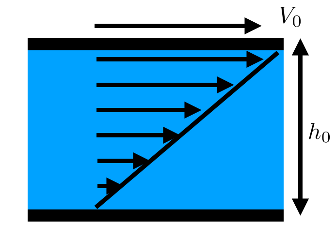
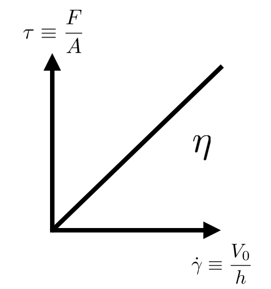
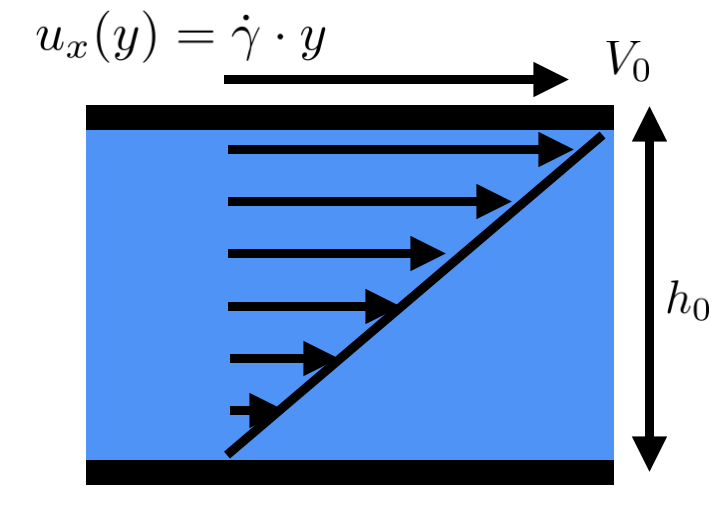
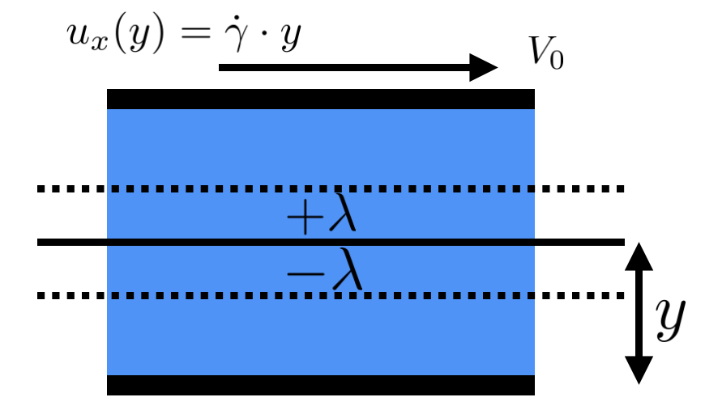
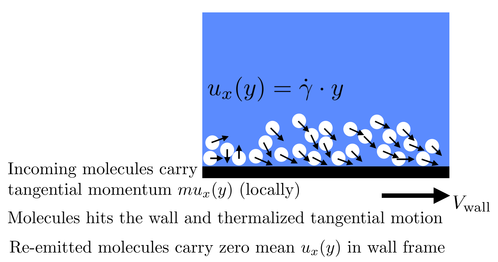

# Lecture 2: Viscosity and Momentum Diffusion

Understanding viscosity as an emergent property arising from molecular collisions and free flights—the diffusion of tangential momentum through a fluid. This lecture bridges [[1.5-Taylor-Culick-Paradox|Lecture 1.5]]'s resolution of the Taylor–Culick paradox with the continuum mechanics framework needed to model soft matter flows.

---

## Learning Objectives

By the end of this lecture, you should understand these five core concepts:

1. **What viscosity is:** a coefficient quantifying the *diffusion of tangential momentum*
2. **Where it comes from (kinetics):** molecular collisions + free flights over the mean free path $\lambda$
3. **Why no-slip is natural:** collisions at a wall randomize tangential momentum → momentum sink → velocity gradient forms
4. **Two key scalings:**
   - $\eta \sim \frac{1}{3}\rho \bar{c} \lambda$ (viscosity; depends on density, speed, path length)
   - $\nu = \eta/\rho \sim \frac{\bar{c}\lambda}{3}$ (kinematic viscosity = momentum diffusivity)
5. **Later connections:** Newtonian stress law in continuum mechanics; relaxation-function picture in rheology

---

## Part A: Empirical Starting Point — Newton's Law

We begin with Newton's law of viscosity, the foundational definition of a Newtonian fluid:

$$\boxed{\tau_{xy} = \eta \dot{\gamma} = \eta \frac{\partial u_x}{\partial y}}$$

This equation states that shear stress is proportional to shear rate, with a constant of proportionality—the viscosity $\eta$—that depends on the material and temperature, but *not* on how fast we shear it. This is the **foundational definition** of a Newtonian fluid.

### Key Definitions

- **Shear stress** $\tau_{xy}$ (Pa = N/m$^2$): force per unit area acting tangentially on a fluid layer
- **Strain rate** $\dot{\gamma} = \partial u_x / \partial y$ (s$^{-1}$): the spatial gradient of velocity; how quickly the velocity changes across the fluid
- **Viscosity** $\eta$ (Pa$\cdot$s): the coupling coefficient; higher $\eta$ means stickier fluid
- **Kinematic viscosity** $\nu = \eta/\rho$ (m$^2$/s): the "speed" at which momentum diffuses through the fluid

> [!important] Distinguishing Newtonian vs. Non-Newtonian Fluids
>
> A Newtonian fluid has **constant $\eta$ at fixed temperature**—it doesn't matter if you shear slowly or fast. Many familiar fluids like water, air, and simple oils are Newtonian. However, ketchup, blood, and polymer solutions are *non-Newtonian* ($\eta$ changes with $\dot{\gamma}$); we'll encounter these behaviors in Lectures 5 and 6.

**Physical Interpretation:** Viscosity represents internal friction—the resistance of the fluid to shearing motion.

---

## Part B: First Principles — Kinetic Theory Derivation

### The Fundamental Concept

Viscosity emerges because **molecules carry momentum across planes** during free flights between collisions. When the flow has a shear (velocity gradient), molecules from fast and slow regions mix, and this **diffuses momentum down the gradient.**

---

### Setup: Simple Couette Flow

Consider a steady shear flow where:
- Velocity varies linearly: $u_x(y) = \dot{\gamma} \cdot y$
- Mean free path: $\lambda$
- Mean molecular speed: $\bar{c} = \sqrt{8 k_B T / (\pi m)}$ (monatomic gas)
- Number density: $n$

In this geometry, molecules at height $y$ have average $x$-velocity $u_x(y)$. But they only came to height $y$ after traveling a distance $\sim \lambda$ through the fluid. The $x$-momentum they carry reflects the conditions they saw $\sim \lambda$ away—this is where the velocity gradient matters.

---

### Step 1: Molecular Flux Across a Plane

For an isotropic gas, the number of molecules crossing a plane (per unit area per unit time) is:

$$\boxed{J = \frac{1}{4} n \bar{c}}$$

This factor of 1/4 arises from two geometric considerations:
- **Half** the molecules move upward and **half** downward (factor of 1/2)
- Of those moving upward, the average normal component of velocity is $\bar{c}/2$ because the mean direction makes approximately a 60° angle to the normal

Therefore: $\langle v_y^+ \rangle = (1/2) \times (1/2) \bar{c} = \bar{c}/4$, giving $J = n \bar{c}/4$.

#### Alternative Derivation

For a more rigorous approach, we integrate over the hemisphere of upward directions:

$$\langle v_y^+ \rangle_{\text{dir}} = \frac{1}{4\pi} \int_{\text{hemisphere}} c \cos\theta \, d\Omega = \frac{1}{4\pi} \int_0^{2\pi} d\phi \int_0^{\pi/2} c\cos\theta \sin\theta \, d\theta = \frac{c}{4}$$

Averaging over the Maxwellian speed distribution yields $J = n \bar{c}/4$.

---

### Step 2: Momentum Transport

A molecule crossing the plane upward was last collided at approximately $y-\lambda$, so it carries the mean $x$-momentum from that height. Similarly, a molecule crossing downward carries momentum from around $y+\lambda$.

---

### Step 3: Net Momentum Flux

The momentum fluxes are:

**Downward momentum flux** (from above):
$$\Phi_{x}^{\text{down}} \approx \frac{n\bar{c}}{4} \cdot m \cdot u_x(y+\lambda)$$

**Upward momentum flux** (from below):
$$\Phi_{x}^{\text{up}} \approx \frac{n\bar{c}}{4} \cdot m \cdot u_x(y-\lambda)$$

**Net downward flux** (down minus up):
$$\Phi_{x}^{\text{net}} = \frac{nm\bar{c}}{4}\left[ u_x(y+\lambda) - u_x(y-\lambda) \right]$$

For small $\lambda$, we can linearize the velocity:
$$u_x(y\pm\lambda) \approx u_x(y) \pm \lambda \frac{\partial u_x}{\partial y}$$

Therefore:
$$u_x(y+\lambda) - u_x(y-\lambda) \approx 2\lambda \frac{\partial u_x}{\partial y}$$

Substituting:
$$\boxed{\Phi_{x}^{\text{net}} \approx \frac{nm\bar{c}}{4} \cdot 2\lambda \frac{\partial u_x}{\partial y} = \frac{1}{2} \rho \bar{c} \lambda \frac{\partial u_x}{\partial y}}$$

where $\rho = nm$ is the mass density.

---

### Step 4: Identifying Shear Stress and Viscosity

**Critical Relationship:** The *shear stress* in the continuum description is **minus** the downward flux of $x$-momentum. The minus sign accounts for direction convention: if molecules flow momentum downward (from fast to slow regions), this represents a stress acting downward.

$$\tau_{xy} = -\Phi_{x}^{\text{net}} = -\frac{1}{2} \rho \bar{c} \lambda \frac{\partial u_x}{\partial y}$$

Comparing with Newton's law:
$$\tau_{xy} = -\eta \frac{\partial u_x}{\partial y}$$

We obtain:

$$\boxed{\eta \sim C \, \rho \, \bar{c} \, \lambda, \quad\text{where } C = \mathcal{O}(1)}$$

The more sophisticated Chapman-Enskog theory gives $C \approx 1/3$ for a monatomic gas, but the **scaling relationship is the key physical insight**.

---

### Step 5: Kinematic Viscosity as Momentum Diffusivity

The kinematic viscosity is:

$$\boxed{\nu = \frac{\eta}{\rho} \sim C \, \bar{c} \, \lambda}$$

**Physical Interpretation:** The kinematic viscosity $\nu$ is the **diffusivity for momentum**. Just as thermal diffusivity ($\alpha$) measures how fast heat spreads, $\nu$ measures how fast shear (tangential momentum) propagates through a fluid.

**Dimensional Analysis:** $[\bar{c}][\lambda] = \text{(m/s)} \times \text{(m)} = \text{m}^2/\text{s}$ ✓

---

## Part C: Boundary Condition — Where Does No-Slip Come From?

### The Wall Picture

### Physical Mechanism

> [!summary] Momentum Accommodation at Walls
> When a gas molecule collides with a stationary wall, the wall randomizes (thermalizes) its tangential velocity component. The molecule re-emits with zero mean tangential velocity in the wall frame. This process is called diffuse reflection with full tangential momentum accommodation.

The wall acts as a sink of $x$-momentum. Every molecule that hits the wall loses its tangential velocity. Just outside the wall, there's a deficit in mean $u_x$ compared to the interior.

---

### Interior Response: Momentum Balance

In steady state, the **viscous flux from the interior** must feed the **momentum sink at the wall**.

**Rate of momentum removal at wall** (per unit area):
$$\text{Removal rate} \sim \underbrace{\left(\frac{1}{4}n\bar{c}\right)}_{\text{collision rate}} \times \underbrace{m u_x(0^+)}_{\text{momentum per molecule}}$$

where $u_x(0^+)$ is the fluid velocity just outside the wall.

**Rate of momentum supply via viscous diffusion:**
$$\text{Supply rate} = -\tau_{xy}\big|_{\text{wall}} = \eta \frac{\partial u_x}{\partial y}\bigg|_{\text{wall}}$$

**Steady-state balance:**
$$\eta \frac{\partial u_x}{\partial y}\bigg|_{\text{wall}} \sim \frac{1}{4}n\bar{c} \, m \, u_x(0^+)$$

For small $u_x(0^+)$ or perfect accommodation, this forces $u_x(0^+) \to u_{\text{wall}} = 0$.

**Result:**

$$\boxed{u_{\text{fluid}}(\text{wall}) = u_{\text{wall}} \quad\text{(no-slip condition)}}$$

---

### When Does Slip Appear?

No-slip is the **continuum limit**, valid when the mean free path $\lambda$ is much smaller than any relevant geometric length (Knudsen number $\text{Kn} = \lambda/L \ll 1$).

**For rarefied gases or special surfaces** (non-accommodating walls):

The wall doesn't fully thermalize the tangential momentum, resulting in **partial slip**:

$$u_{\text{slip}} = u_{\text{fluid}}(0) - u_{\text{wall}} = b \frac{\partial u_x}{\partial y}\bigg|_{\text{wall}}$$

where the **slip length** is $b \sim \mathcal{O}(\lambda)$, modulated by an accommodation coefficient.

**Maxwell slip law:**

$$\boxed{b \approx C_{\text{acc}} \lambda, \quad C_{\text{acc}} \approx 1-2}$$

---

### Connecting Bulk Viscosity to Wall Shear

**Key Insight:**

$$\boxed{\text{The same } \eta \text{ that represents bulk momentum diffusion also sets the wall shear rate:}}$$
$$\boxed{\tau_{\text{wall}} = \eta \frac{\partial u_x}{\partial y}\bigg|_{\text{wall}} = \text{rate at which wall removes x-momentum}}$$

---

## Part D: Continuum View — Momentum Diffusion Equation

### Stokes' First Problem (Impulsive Start)

**Physical Setup:** A semi-infinite fluid initially at rest; at $t=0$, a plate at $y=0$ suddenly moves with velocity $U$.

**Initial and Boundary Conditions:**
- $u_x(y, 0) = 0$ for all $y > 0$
- $u_x(0, t) = U$ for $t > 0$

**Governing Equation (momentum diffusion):**

$$\boxed{\frac{\partial u_x}{\partial t} = \nu \frac{\partial^2 u_x}{\partial y^2}}$$

where $\nu = \eta/\rho$ is the kinematic viscosity (momentum diffusivity).

### Scaling Analysis

The momentum **penetrates** into the fluid over a diffusion layer of thickness:
$$\boxed{\delta(t) \sim \sqrt{\nu t}}$$

**Physical Insight:** This equation is *exactly* analogous to heat diffusion or dye diffusion. Viscosity $\nu$ plays the role of thermal or mass diffusivity. This confirms our kinetic picture: **viscosity is the diffusivity for momentum.**

> [!link] Full derivation
> Head to [[Impulsively-started-plate]] for the derivation. 

---

### Visual Representation

    <iframe width="560" height="315" src="https://www.youtube-nocookie.com/embed/cJWlouRJUNU?si=iWYa8eQIgSscSFBo"
        title="YouTube video player" frameborder="0"
        allow="accelerometer; autoplay; clipboard-write; encrypted-media; gyroscope; picture-in-picture; web-share"
        referrerpolicy="strict-origin-when-cross-origin" allowfullscreen>
    </iframe>

---

### Non-Newtonian Fluids

The Newtonian law $\tau = \eta \dot{\gamma}$ works when:
- The fluid has **no internal structure** that deforms under shear
- Or the structure **adapts quickly** compared to the flow timescale

For polymer solutions, suspensions, or emulsions:
- Microstructure (chains, particles) **realigns** under shear
- Viscosity becomes a function of shear rate: $\eta(\dot{\gamma})$
- This leads to phenomena like shear-thinning or shear-thickening

Today we derived why Newtonian behavior is natural for a dilute gas. Real soft-matter systems are more interesting because their microstructure evolves—that's where non-Newtonian rheology comes in.

---

### Reynolds Number: Viscous vs. Inertial Effects

$$\boxed{\text{Re} = \frac{U L}{\nu}}$$

- $U L$: characteristic scale of *advection* (inertial effects)
- $\nu$: characteristic scale of *momentum diffusion* (viscous effects)

**Physical Interpretation:**
- **High Re**: Inertia dominates → turbulence, jets
- **Low Re**: Viscosity dominates → creeping flow, microfluidics
- The transition region is where rich physics emerges

---

## Summary

$$\boxed{\text{Newton's Law:} \quad \tau_{xy} = \eta \dot{\gamma}}$$

$$\boxed{\text{Kinetic Picture:} \quad \eta \sim \frac{1}{3} \rho \bar{c} \lambda, \quad \nu = \frac{\eta}{\rho} \sim \frac{\bar{c} \lambda}{3}}$$

$$\boxed{\text{Wall Physics (No-Slip):} \quad u_{\text{fluid}}(\text{wall}) = u_{\text{wall}}}$$
(emerges when wall thermalizes momentum; fails at high Kn)

$$\boxed{\text{Continuum Picture:} \quad \frac{\partial u}{\partial t} = \nu \frac{\partial^2 u}{\partial y^2} \quad \Rightarrow \quad \delta(t) \sim \sqrt{\nu t}}$$

---

## Conceptual Takeaway

> Viscosity is to momentum what diffusivity is to dye: it smooths out gradients in tangential velocity by spreading momentum from fast to slow regions. At the wall, the same microscopic physics—collisional randomization of tangential momentum—produces the no-slip condition in the continuum limit, and predicts slip when the mean free path is not negligible.

---

## Temperature Scaling

An important distinction emerges between gases and liquids:

**Gases:** Viscosity **increases** with temperature because faster molecules (larger $\bar{c}$) transport momentum more efficiently over larger mean free paths.

**Liquids:** Viscosity typically **decreases** with temperature due to cage-breaking dynamics and activation processes—fundamentally different from the gas-phase mechanism.

This inversion is crucial for developing physical intuition across different material systems.

---

## References & Further Reading

### Primary Literature

- **Chapman & Cowling (1970):** *The Mathematical Theory of Non-Uniform Gases.* (Classic kinetic theory; Sections 2–4 for viscosity.)
- **Reif (1965):** *Fundamentals of Statistical and Thermal Physics.* (Kinetic-theory.)
- **Bird, Stewart & Lightfoot (2007):** *Transport Phenomena.* (Chapter 1: connection between kinetic theory and continuum viscosity.)

### Supplementary Materials

- [What is Viscosity (PDF)](whatIsViscosity.pdf) — Comprehensive reference document on kinetic theory foundations

### Foundational Texts
- **de Gennes, P.-G.** (1979). *Scaling Concepts in Polymer Physics*. Cornell University Press. — Soft matter perspective on viscosity
- **Landau & Lifshitz** (1987). *Fluid Mechanics* (2nd ed.). Pergamon. — Classical continuum mechanics with kinetic theory foundations

### Advanced Topics
- **Evans & Searles** (2002). "The fluctuation theorem." *Advances in Physics*, **51**(7), 1529–1585. — Non-equilibrium statistical mechanics
- **Kremer & Grest** (1990). "Dynamics of entangled linear polymer melts." *The Journal of Chemical Physics*, **92**(8), 5057–5086. — Polymer rheology from kinetic theory

### Application Areas
- **Doi, M. & Edwards, S. F.** (1986). *The Theory of Polymer Dynamics*. Oxford University Press. — Viscoelasticity and non-Newtonian viscosity

---

## Connection to Lecture 3

The viscosity framework we've developed—understanding it as momentum diffusion—directly connects to the **instabilities** and **singularities** that emerge in soft matter flows. In Lecture 3, we will see how surface tension and viscosity compete to either suppress or amplify perturbations at interfaces, leading to phenomena like the Rayleigh–Plateau instability and capillary breakup.

Understanding why momentum diffusion acts as a dissipative force (damping) is central to analyzing these instabilities.

---

## Key Takeaways

1. **Viscosity is momentum diffusion.** The same framework that describes heat spreading describes how shear spreads through a fluid.

2. **Kinetics connects to continuum.** A simple kinetic-theory argument ($\eta \sim \rho \bar{c} \lambda$) bridges molecular collisions and macroscopic stress.

3. **No-slip emerges from momentum accommodation.** The wall isn't a boundary condition imposed from above—it's a consequence of efficient tangential momentum randomization at collisions.

4. **Temperature effects differ.** Gases become more viscous when heated (faster molecules); liquids usually become less viscous (cage-breaking). Recognizing this inversion is important for intuition.

5. **Reynolds number quantifies the balance.** Re = (inertial effects) / (viscous effects). High Re: inertia dominates. Low Re: viscosity dominates. The transition is where interesting physics happens.

6. **Continuum equation mirrors diffusion.** The PDE $\partial u/\partial t = \nu \partial^2 u/\partial y^2$ is the Navier–Stokes momentum equation in its simplest form. Recognizing $\nu$ as a diffusivity (not just a material property) unifies understanding.

---

> [!significance]- Metadata
> Author:: [Vatsal Sanjay](https://vatsalsanjay.com) 
> Date published:: Oct 29, 2025 
> Date modified:: Oct 29, 2025
>
> Lecture note on viscosity as momentum diffusion, connecting kinetic theory to continuum mechanics and soft matter flows.

> [!link] Back to main website
> [Home](https://comphy-lab.org/), [Team](https://comphy-lab.org/team), [Research](https://comphy-lab.org/research), [Github](https://github.com/comphy-lab)
>
> 📝 [Edit this page on GitHub](https://github.com/comphy-lab/CoMPhy-Lab-Blogs/blob/main/Lecture-Notes/Intro-Soft-Matter/2-What-is-Viscosity.md)
