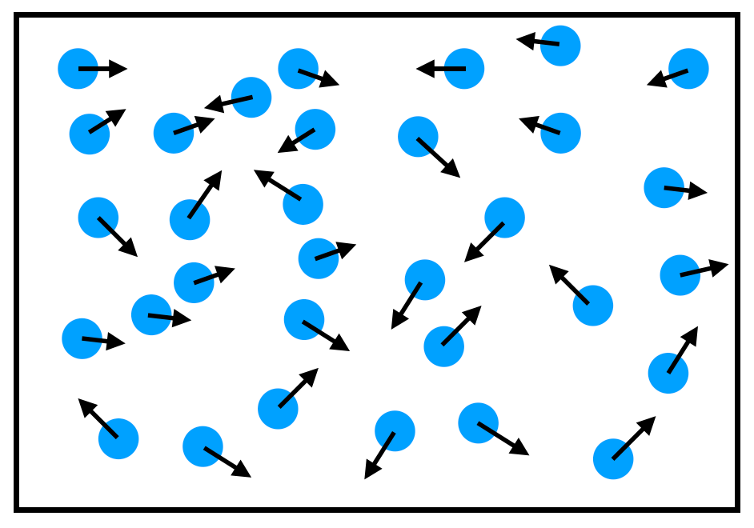

<!-- PDF-EXPORT-IGNORE-START -->
> [!info] 📄 PDF Version
> [Download PDF](./2.5-Conservation-Laws.pdf)
<!-- PDF-EXPORT-IGNORE-END -->

# Lecture 2: From Newton's Laws to Conservation Equations

## Learning Goals

By the end of this lecture, you should understand:

> 1. Newton's second law for one particle: $\boldsymbol{F} = m\boldsymbol{a}$, and how it extends to many particles
> 2. Microscopic fields from particles: how to convert a sum of point particles into continuous density fields using Dirac deltas
> 3. The moving delta identity: $\partial_t \delta(\boldsymbol{r} - \boldsymbol{r}_i(t)) = -\boldsymbol{v}_i \cdot \nabla \delta_i$ (see [[Moving-Delta-identity|detailed note]])
> 4. Microscopic continuity equation: how mass conservation emerges at the particle level
> 5. Pairwise forces → divergence of stress: how pair forces become a flux tensor (see [[Virial-identity|detailed note]])
> 6. Microscopic momentum balance: $\partial_t \boldsymbol{g} + \nabla \cdot \boldsymbol{\Pi} = \rho \boldsymbol{b}$
> 7. Coarse-graining → Cauchy stress: how ensemble averaging yields the Cauchy momentum equation $\rho \frac{D\boldsymbol{v}}{Dt} = \nabla \cdot \boldsymbol{\sigma} + \rho \boldsymbol{b}$
> 8. Physical intuition: internal forces appear as *stresses* (forces per unit area) in the continuum description

---

## Part A: Newton's Second Law — Scalar to Many Particles

### Single particle (warm-up)

Write on board:

$$\boxed{m \dot{\boldsymbol{v}} = \boldsymbol{F}^{\text{ext}}}$$

### Many particles (N particles, pairwise forces)

Write:

$$\boxed{m_i \dot{\boldsymbol{v}}_i = \boldsymbol{f}_i^{\rm ext} + \sum_{j \ne i} \boldsymbol{f}_{ij}, \qquad \boldsymbol{f}_{ij} = -\boldsymbol{f}_{ji}}$$

> [!important] Important
> We start here: every particle obeys Newton's second law with external forces and pair interactions. The key assumption — which is exact in classical mechanics — is that the force one particle exerts on another is *equal and opposite* ($\boldsymbol{f}_{ij} = -\boldsymbol{f}_{ji}$, Newton's third law). This symmetry is crucial: it will let us turn distributed forces into a stress tensor.

- $m_i$: mass of particle $i$
- $\boldsymbol{v}_i = \dot{\boldsymbol{r}}_i(t)$: velocity of particle $i$
- $\boldsymbol{f}_i^{\rm ext}$: external force (gravity, walls, etc.)
- $\boldsymbol{f}_{ij}$: force exerted by particle $j$ on particle $i$
- $\boldsymbol{f}_{ij} = -\boldsymbol{f}_{ji}$: action–reaction; internal forces *cancel* when you sum over all particles

---

## Part B: Convert Particles to Fields Using Dirac Deltas

### Big idea

> [!info] 
> We want to describe the fluid at *every point in space*, not just at discrete particle locations. To do that, we represent each particle as a moving point mass — a Dirac delta spike at $\boldsymbol{r}_i(t)$. Then we can define continuous fields: density, momentum, stress, etc.

---

### Setup: Microscopic fields




#### Density:

$$\boxed{\rho(\boldsymbol{r}, t) = \sum_{i=1}^N m_i \, \delta(\boldsymbol{r} - \boldsymbol{r}_i(t))}$$

#### Momentum:
$$\boxed{\boldsymbol{g}(\boldsymbol{r}, t) = \sum_{i=1}^N m_i \, \boldsymbol{v}_i(t) \, \delta(\boldsymbol{r} - \boldsymbol{r}_i(t))}$$

where $\delta_i(\boldsymbol{r}, t) := \delta(\boldsymbol{r} - \boldsymbol{r}_i(t))$ is a spike centered on particle $i$.


> [!tldr] TL;DR
> Each particle contributes a delta spike to the density field. At the location $\boldsymbol{r}_i$, the spike has 'height' (or weight) equal to the particle's mass. The momentum density $\boldsymbol{g}$ does the same but weights by $m_i \boldsymbol{v}_i$. These fields are exact — there's no averaging yet. But they're spiky and discontinuous; what we want eventually is a smooth continuum limit.

---

## Part C: Microscopic Continuity — Mass Conservation at the Particle Level

### The key identity: moving delta


> [!important]
> To convert particle equations into field equations, we need one crucial identity: how does a Dirac delta change when the particle moves? This is the moving delta identity (see [[Moving-Delta-identity|detailed derivation]]).


$$\boxed{\partial_t \delta_i(\boldsymbol{r}, t) = -\boldsymbol{v}_i \cdot \nabla_{\boldsymbol{r}} \delta_i(\boldsymbol{r}, t) = -\boldsymbol{v}_i \cdot \nabla_{\boldsymbol{r}} \delta(\boldsymbol{r} - \boldsymbol{r}_i(t))}$$


> This is the advection equation for a spike. The time rate of change at a fixed point $\boldsymbol{r}$ is minus the spatial change (gradient) in the direction the spike moves. See [[Moving-Delta-identity|detailed derivation]] for three ways to justify this.

---

### Derive mass continuity

Start with the definition of $\rho$:
$$\partial_t \rho = \sum_i m_i \, \partial_t \delta_i$$

Use the moving delta identity:
$$\partial_t \rho = -\sum_i m_i \, \boldsymbol{v}_i \cdot \nabla_{\boldsymbol{r}} \delta_i$$

Factor out the gradient (it acts only on $\boldsymbol{r}$, not on $\boldsymbol{v}_i(t)$):
$$\partial_t \rho = -\nabla_{\boldsymbol{r}} \cdot \sum_i m_i \, \boldsymbol{v}_i \, \delta_i$$

Recognize the sum as the momentum density $\boldsymbol{g}$:
$$\partial_t \rho = -\nabla \cdot \boldsymbol{g}$$


$$\boxed{\partial_t \rho + \nabla \cdot \boldsymbol{g} = 0} \quad \text{(Microscopic continuity equation)}$$


> [!tip]
> That one identity—the moving delta—is the *entire algebra.* It converts a sum of moving spikes into a divergence of momentum density. This is mass conservation at the microscopic level: if mass flows out of a region at rate $\nabla \cdot \boldsymbol{g}$, the local density must decrease at rate $\partial_t \rho$. No approximation yet—this is exact for point particles.

---

## Part D: Microscopic Momentum Balance — Where Stress Is Born

> [!question] Idea
> Now we take the time derivative of the momentum density. Newton's second law says particles accelerate due to the net external forces. When we convert that into a field equation, the internal (pair) forces turn into a divergence of a tensor—and that tensor is the stress.

---

### Step 1: Time derivative of momentum density


$$\partial_t \boldsymbol{g} = \sum_i m_i \, \partial_t(\boldsymbol{v}_i \delta_i)$$

Use the product rule:
$$\partial_t \boldsymbol{g} = \sum_i m_i \, \dot{\boldsymbol{v}}_i \, \delta_i + \sum_i m_i \, \boldsymbol{v}_i \, \partial_t \delta_i$$

The first term is the acceleration field; the second is what needs conversion. See [[Dyadic-conversion|detailed note]] for the algebra, but the result is:

$$\boxed{\sum_i m_i \, \boldsymbol{v}_i \, \partial_t \delta_i = -\nabla \cdot \sum_i m_i \, \boldsymbol{v}_i \boldsymbol{v}_i \, \delta_i}$$

where $\boldsymbol{v}_i \boldsymbol{v}_i$ is the outer product (dyad): $(\boldsymbol{v}_i \boldsymbol{v}_i)_{\alpha\beta} = v_{i\alpha} v_{i\beta}$.

Define the kinetic momentum-flux tensor:

$$\boxed{\boldsymbol{K}(\boldsymbol{r}, t) = \sum_i m_i \, \boldsymbol{v}_i \boldsymbol{v}_i \, \delta_i}$$

So:

$$\partial_t \boldsymbol{g} = \sum_i m_i \, \dot{\boldsymbol{v}}_i \, \delta_i - \nabla \cdot \boldsymbol{K}$$

---

### Step 2: Insert Newton's second law

From Newton's 2nd law:

$$m_i \dot{\boldsymbol{v}}_i = \boldsymbol{f}_i^{\rm ext} + \sum_{j \ne i} \boldsymbol{f}_{ij}$$

So:
$$\sum_i m_i \, \dot{\boldsymbol{v}}_i \, \delta_i = \underbrace{\sum_i \boldsymbol{f}_i^{\rm ext} \, \delta_i}_{\rho \boldsymbol{b}} + \sum_i \sum_{j \ne i} \boldsymbol{f}_{ij} \, \delta_i$$

where $\boldsymbol{b}$ is the external body force per unit mass (e.g., gravity), and $\rho \boldsymbol{b}$ is the external force per unit volume.


$$\partial_t \boldsymbol{g} + \nabla \cdot \boldsymbol{K} = \rho \boldsymbol{b} + \underbrace{\sum_i \sum_{j \ne i} \boldsymbol{f}_{ij} \, \delta_i}_{\text{internal forces}}$$

---

### Step 3: Turn pairwise forces into a divergence of the virial tensor

This is the non-obvious step. See [[Virial-identity|detailed derivation]] for the full proof, but the key result is:

$$\boxed{\sum_i \sum_{j \ne i} \boldsymbol{f}_{ij} \, \delta_i = -\nabla \cdot \boldsymbol{C}}$$

where $\boldsymbol{C}$ is the configurational (virial) momentum-flux tensor:

$$\boldsymbol{C}(\boldsymbol{r}, t) = \frac{1}{2} \sum_{i \ne j} \boldsymbol{r}_{ij} \, \boldsymbol{f}_{ij} \int_0^1 \delta(\boldsymbol{r} - \boldsymbol{r}_j - s \boldsymbol{r}_{ij}) \, ds$$
> [!tldr] Note:
> Each pair force is 'smeared' uniformly along the bond connecting the two particles. When you take the divergence, you recover the two point forces at the ends—equal and opposite, as required. The integral parameterizes the bond; it's just a mathematical trick to convert point forces into a flux.

> [!important] Important
> Internal forces don't vanish when summed over all particles, but they appear locally as a divergence of a stress-like tensor. This is the transition from particles to continuum: pair forces become components of the stress tensor.

---

### Step 4: Complete microscopic momentum balance

Gather all terms:

$$\boxed{\partial_t \boldsymbol{g} + \nabla \cdot (\boldsymbol{K} + \boldsymbol{C}) = \rho \boldsymbol{b}}$$

Define the total microscopic momentum-flux tensor:

$$\boxed{\boldsymbol{\Pi} := \boldsymbol{K} + \boldsymbol{C}}$$

So:

$$\boxed{\partial_t \boldsymbol{g} + \nabla \cdot \boldsymbol{\Pi} = \rho \boldsymbol{b}} \quad \text{(Microscopic momentum balance)}$$

> [!important]
> This is exact: no averaging, no approximation. Every term comes from Newton's second law and the geometry of deltas. The tensor $\boldsymbol{\Pi}$ contains two pieces: kinetic ($\boldsymbol{K}$, from bulk motion and random thermal motion) and configurational ($\boldsymbol{C}$, from pair forces). Together, they form the microscopic stress.

---

## Part E: Coarse-Grain to Get Cauchy's Momentum Equation

> [!question] Idea
> The microscopic equation is spiky and exact, but a real fluid isn't made of point particles—we have $\sim 10^{23}$ particles per cm$^3$. So we ensemble-average (or volume-average) over a mesoscopic region that contains many particles but is still small enough to resolve macroscopic gradients.

---

### Define macroscopic fields via averaging

See [[Coarse-graining-momentum-to-Cauchy|detailed derivation]] for the complete mathematical treatment. 

$$\langle \rho \rangle = \rho, \quad \langle \boldsymbol{g} \rangle = \rho \boldsymbol{v}, \quad \langle \boldsymbol{\Pi} \rangle \equiv \overline{\boldsymbol{\Pi}}$$

where the angle brackets denote ensemble (or volume) averaging.

Key observation: The momentum density $\boldsymbol{g}$ has two components:
- Bulk momentum: $\rho \boldsymbol{v}$ (all particles drifting in the same direction)
- Random (thermal) momentum: from velocity fluctuations around the mean

---

### Split the flux: convection + stress

Write the crucial definition:

$$\boxed{\overline{\boldsymbol{\Pi}} = \rho \boldsymbol{v} \boldsymbol{v} - \boldsymbol{\sigma}}$$

where $\boldsymbol{\sigma}$ is the Cauchy stress tensor:

Breaking it down:
- $\overline{\boldsymbol{K}} = \rho \boldsymbol{v} \boldsymbol{v}$: bulk contribution to stress
- $\overline{\boldsymbol{C}} = -\boldsymbol{\sigma}$: configurational (virial) contribution to stress (from pair forces)


> [!important]
> The stress tensor is defined as the part of the momentum flux that isn't accounted for by the bulk drift. It captures how internal forces and thermal motion resist (or facilitate) deformation. For a gas at rest, it's just pressure. For a flowing fluid under shear, it includes viscous stresses.

---

### Derive Cauchy's momentum equation

Average the microscopic balance:

$$\partial_t \langle \boldsymbol{g} \rangle + \nabla \cdot \overline{\boldsymbol{\Pi}} = \rho \boldsymbol{b}$$

Substitute $\langle \boldsymbol{g} \rangle = \rho \boldsymbol{v}$ and $\overline{\boldsymbol{\Pi}} = \rho \boldsymbol{v} \boldsymbol{v} - \boldsymbol{\sigma}$:

$$\partial_t(\rho \boldsymbol{v}) + \nabla \cdot(\rho \boldsymbol{v} \boldsymbol{v}) - \nabla \cdot \boldsymbol{\sigma} = \rho \boldsymbol{b}$$

Use the continuity equation $\partial_t \rho + \nabla \cdot (\rho \boldsymbol{v}) = 0$ to simplify:

$$\rho \frac{\partial \boldsymbol{v}}{\partial t} + \rho (\boldsymbol{v} \cdot \nabla) \boldsymbol{v} = \nabla \cdot \boldsymbol{\sigma} + \rho \boldsymbol{b}$$


$$\boxed{\rho \frac{D\boldsymbol{v}}{Dt} = \nabla \cdot \boldsymbol{\sigma} + \rho \boldsymbol{b}} \quad \text{(Cauchy momentum equation)}$$

where $\frac{D}{Dt} = \frac{\partial}{\partial t} + \boldsymbol{v} \cdot \nabla$ is the material (convective) derivative.


> [!tldr] TL;DR
> This is the continuum momentum balance. It says: the rate of change of momentum in a moving fluid element equals the net stress applied to it plus external forces. It's valid for *any* fluid, whether Newtonian (constant viscosity) or non-Newtonian. The specific form of $\boldsymbol{\sigma}$ is the constitutive relation, which depends on the fluid's internal structure.

---

## Part F: Why This Matters—Physical Intuition

### The stress tensor is the flux of momentum

Draw on the board:

```
    → → → (fast fluid)
    __________
   |          |  interface (unit area, normal n)
   |__________|
    → → (slow fluid)
```


> Imagine a small surface across the interface. Momentum flows across it in two ways: (1) bulk convection ($\rho \boldsymbol{v} \boldsymbol{v}$ term), and (2) microscopic collisions creating a stress ($-\boldsymbol{\sigma}$ term). The total flux is the product force per unit area, i.e., traction = $\boldsymbol{\sigma} \cdot \boldsymbol{n}$. If the fast fluid pushes on the slow fluid, the traction is positive; the stress tensor quantifies this.

---

### Example: pressure (isotropic stress)

For a fluid at rest or in hydrostatic equilibrium:

$$\boldsymbol{\sigma} = -p \boldsymbol{I}$$

where $p$ is pressure and $\boldsymbol{I}$ is the identity. Then:

$$\nabla \cdot \boldsymbol{\sigma} = -\nabla p, \quad \text{and} \quad \rho \frac{D\boldsymbol{v}}{Dt} = -\nabla p + \rho \boldsymbol{b}$$


> Pressure is the simplest stress: it acts equally in all directions. The gradient $-\nabla p$ pushes fluid from high to low pressure. No viscosity, no shear—just pressure.

---

### Example: viscous stress (Newtonian fluid)

For a Newtonian fluid with viscosity $\eta$:

$$\boldsymbol{\sigma} = -p \boldsymbol{I} + \boldsymbol{\tau}$$

where $\boldsymbol{\tau}$ is the viscous stress (from internal friction and momentum diffusion):

$$\tau_{\alpha\beta} = \eta \left( \frac{\partial v_\alpha}{\partial x_\beta} + \frac{\partial v_\beta}{\partial x_\alpha} \right) + \zeta \delta_{\alpha\beta} (\nabla \cdot \boldsymbol{v})$$

(The second term involves bulk viscosity $\zeta$; for many fluids it's negligible.)


> The viscous stress is proportional to the strain rate $\nabla \boldsymbol{v} + (\nabla \boldsymbol{v})^T$. Faster shear means stronger viscous stress. This is the microscopic momentum diffusion we derived in [[2-What-is-Viscosity|Lecture 2: Viscosity]]—the kinetic theory. But here we've derived it from first principles: a consequence of particle interactions and collisions.

---

## Summary

$$\boxed{\text{Newton (1 particle):}\quad m \dot{\boldsymbol{v}} = \boldsymbol{F}^{\text{ext}}}$$

$$\boxed{\text{Newton (N particles):}\quad m_i \dot{\boldsymbol{v}}_i = \boldsymbol{f}_i^{\rm ext} + \sum_{j \ne i} \boldsymbol{f}_{ij}}$$

$$\downarrow \text{(convert to fields using deltas)}$$

$$\boxed{\text{Microscopic continuity:}\quad \partial_t \rho + \nabla \cdot \boldsymbol{g} = 0}$$

$$\boxed{\text{Microscopic momentum balance:}\quad \partial_t \boldsymbol{g} + \nabla \cdot \boldsymbol{\Pi} = \rho \boldsymbol{b}}$$

$$\downarrow \text{(ensemble average; define stress)}$$

$$\boxed{\text{Cauchy momentum equation:}\quad \rho \frac{D\boldsymbol{v}}{Dt} = \nabla \cdot \boldsymbol{\sigma} + \rho \boldsymbol{b}}$$

---

## Common Misconceptions

| Misconception                                        | Correction                                                                                                                                                            |
| ---------------------------------------------------- | --------------------------------------------------------------------------------------------------------------------------------------------------------------------- |
| Dirac deltas are just very tall, thin spikes.        | They're *distributions*: singular objects defined by their action on test functions. But physically, you can think of them as limits of smooth bumps.                 |
| The moving delta identity is obvious.                | It's not! It requires careful treatment of the chain rule (or test functions). See [[Moving-Delta-identity\|the detailed note]].                                      |
| Internal forces cancel, so they don't matter.        | They cancel *globally*, but they create *local* stresses and are essential for momentum balance in the fluid.                                                         |
| Stress is the same as pressure.                      | Pressure is an isotropic stress (equal in all directions). Stress is more general: it can be anisotropic (different in different directions) and depends on the flow. |
| Coarse-graining is an approximation.                 | It's not an approximation—it's a change of perspective. The microscopic equation is exact but spiky. Averaging converts it into a smooth, usable form.                |
| The Cauchy equation only works for Newtonian fluids. | No. It's exact for *any* fluid. The assumption of Newtonian behavior (constant viscosity) comes *later*, when you specify the constitutive relation.                  |


---

## Thought Experiments

### 1. Why $\boldsymbol{f}_{ij} = -\boldsymbol{f}_{ji}$ matters

Ask: "What if I summed all the internal forces on all particles and got a non-zero result? What would happen?"

> Answer: The center of mass would accelerate without an external force—violating Newton's first law. So action–reaction must hold. And when it does, internal forces create *local* stresses but don't change the total momentum."

---

### 2. Pressure vs. viscous stress

- Pressure: acts equally in all directions; no preferred axis.
- Viscous stress: depends on velocity gradients; has a preferred direction (the direction of shear).

Imagine honey being poured. Gravity provides a pressure gradient (accelerating the fluid downward), and viscosity creates shear stress (resisting the motion between fast-flowing and slow-flowing regions).

---

## Homework / Conceptual Questions

- Coarse-graining in practice: explain what “coarse-graining” means and why it lets us treat soft matter as a continuum. Pick one system (foam, polymer solution, emulsion) and say when this breaks down (give a specific length scale or condition).
- Continuity in a nozzle: You squeeze shampoo through a pump and narrow outlet at steady rate. Using only words, explain why the fluid speeds up in the narrow section and name the conservation law you’re invoking. Give one case where this reasoning would fail.
- Momentum balance around a bend: Water flows steadily through a pipe that turns 90 degrees. Describe which forces turn the flow (pressure differences versus wall shear) and how the picture changes for very slow flows (creeping) versus very fast flows (inertial).
- Where does the work go? You slide two plates with glycerol between them at constant speed. Explain where the mechanical power you input ends up inside the fluid, name the phenomenon responsible (in words), and give a one-sentence microscopic picture for it.

---

## References & Further Reading

- Chapman & Cowling (1970): *The Mathematical Theory of Non-Uniform Gases.* Section 2: kinetic theory and microscopic description.
- Bird, Stewart & Lightfoot (2007): *Transport Phenomena.* Chapter 1: detailed derivation of continuum equations from molecular dynamics.
- Irving & Kirkwood (1950): "The Statistical Mechanical Theory of Transport Processes." Journal of Chemical Physics. (Original microscopic momentum-flux definition; slightly technical but canonical.)
- Doi & Edwards (1986): *The Theory of Polymer Dynamics.* Chapter 2: stress tensor and its microscopic origin.

---

## Quick Assessment (Check your Understanding)

After this lecture, students should be able to:

- Newton's second law for a single particle and for N particles.
- Microscopic fields ($\rho$, $\boldsymbol{g}$) using Dirac deltas and explain why deltas are the right tool.
- Explain the moving delta identity and use it to derive the microscopic continuity equation.
- Explain how pair forces (Newton's third law) turn into a divergence of the virial tensor.
- Derive the microscopic momentum balance and identify the kinetic and configurational components of stress.
- Describe ensemble averaging and explain why it's necessary to transition from spiky microscopic fields to smooth macroscopic fields.
- Derive the Cauchy momentum equation from the microscopic balance and identify the role of the Cauchy stress tensor.
- Explain the physical meaning of the stress tensor and give examples (pressure, viscous stress).
- Understand that the Cauchy equation is exact for any fluid; the Newtonian assumption comes later (constitutive relation).

---

## Connection to Soft Matter

- These laws apply to flows of complex fluids (polymer solutions obey continuity and momentum conservation, with extra stresses)
- Apply to deformable solids (elastic energy is stored energy in the energy equation)
- Foundation for understanding:
  - Fluid instabilities (next lecture)
  - Rheology (later lectures)
  - All continuum modeling of soft matter


---

## Supporting Detailed Notes

These notes contain the mathematical details and alternative proofs that are too long for the main lecture but essential for deep understanding:

- [[Moving-Delta-identity]]: Three detailed proofs of $\partial_t \delta_i = -\boldsymbol{v}_i \cdot \nabla \delta_i$ (chain rule, distributions, 1D sanity check)
- [[Dyadic-conversion]]: The algebraic steps to show $\sum_i m_i \boldsymbol{v}_i \partial_t \delta_i = -\nabla \cdot \sum_i m_i \boldsymbol{v}_i \boldsymbol{v}_i \delta_i$
- [[Virial-identity]]: Full derivation of $\delta_i - \delta_j = -\nabla \cdot \int_0^1 \boldsymbol{r}_{ij} \delta(\ldots) ds$ and its application to pair forces

---

> [!significance]- Metadata
> Author:: [Vatsal Sanjay](https://vatsalsanjay.com)<br>
> Date published:: Oct 29, 2025<br>
> Date modified:: Oct 30, 2025

> [!link] Back to main website
> [Home](https://comphy-lab.org/), [Team](https://comphy-lab.org/team), [Research](https://comphy-lab.org/research), [Github](https://github.com/comphy-lab)
>
> 📝 [Edit this page on GitHub](https://github.com/comphy-lab/CoMPhy-Lab-Blogs/blob/main/Lecture-Notes/Intro-Soft-Matter/2.5-Conservation-Laws.md)