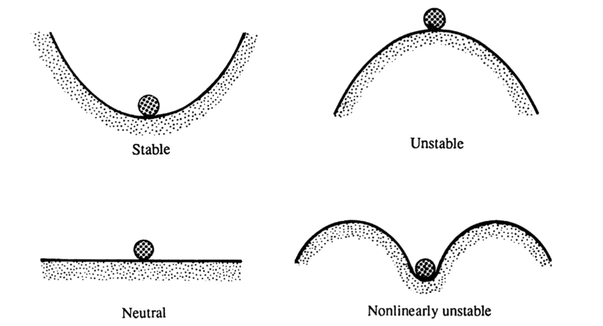
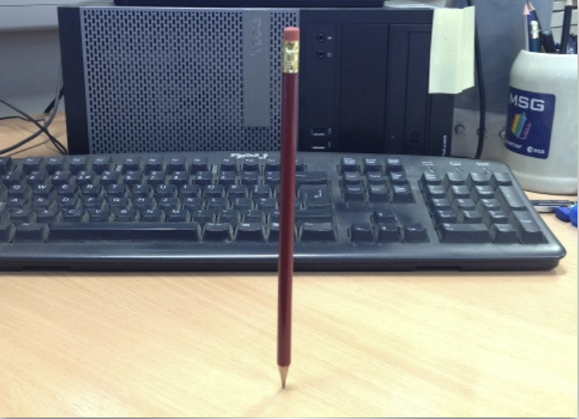
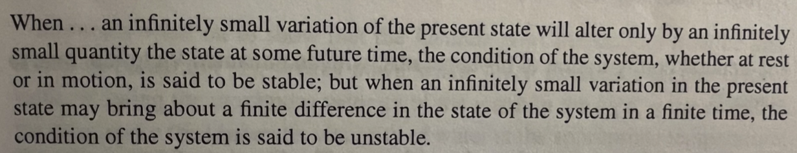
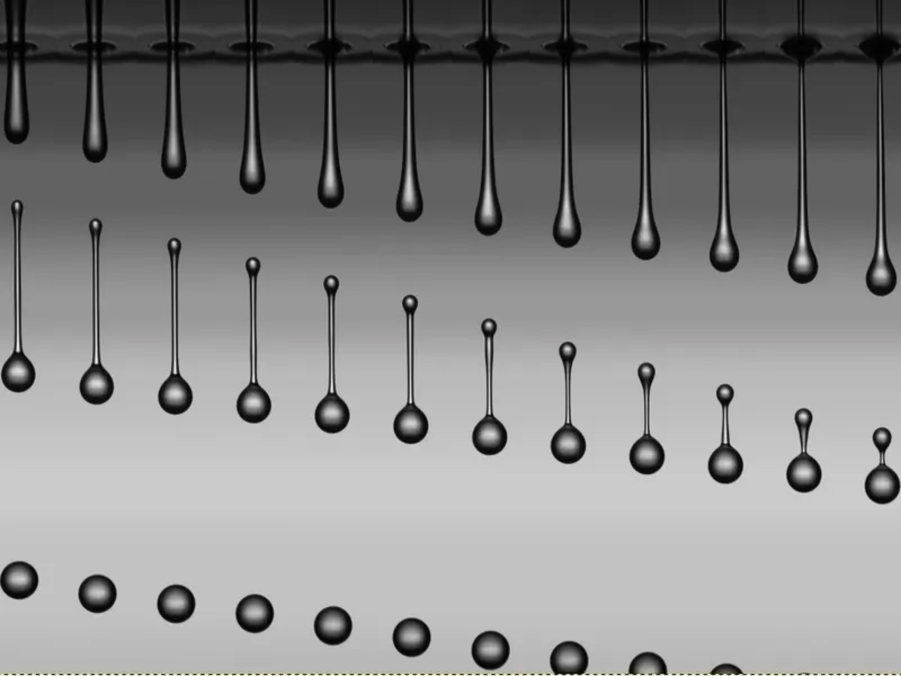
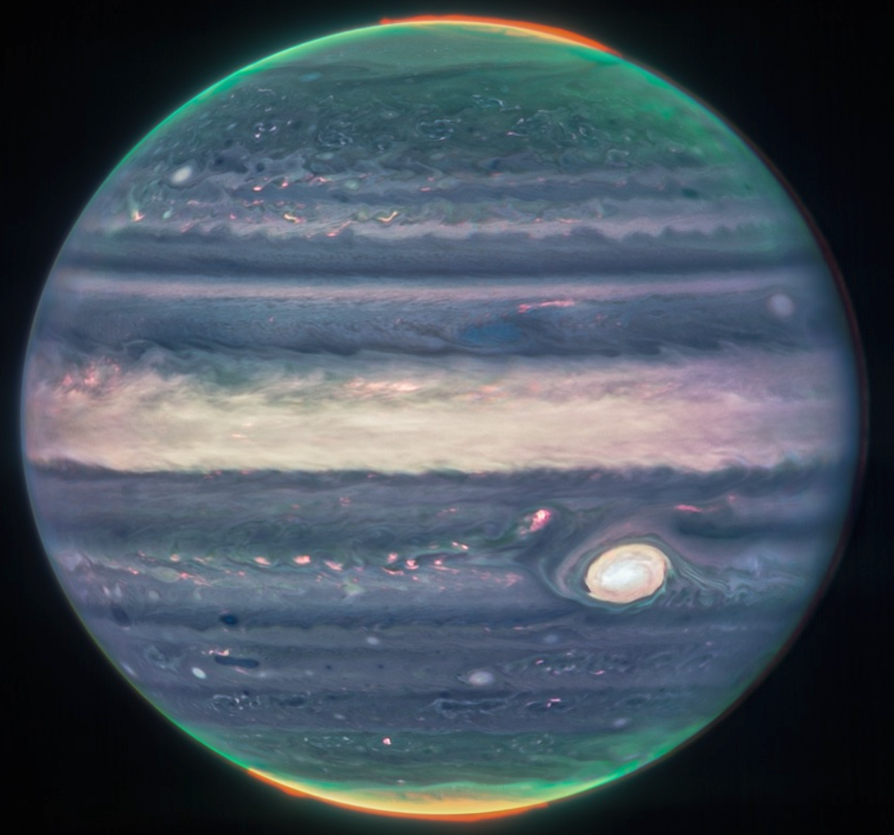
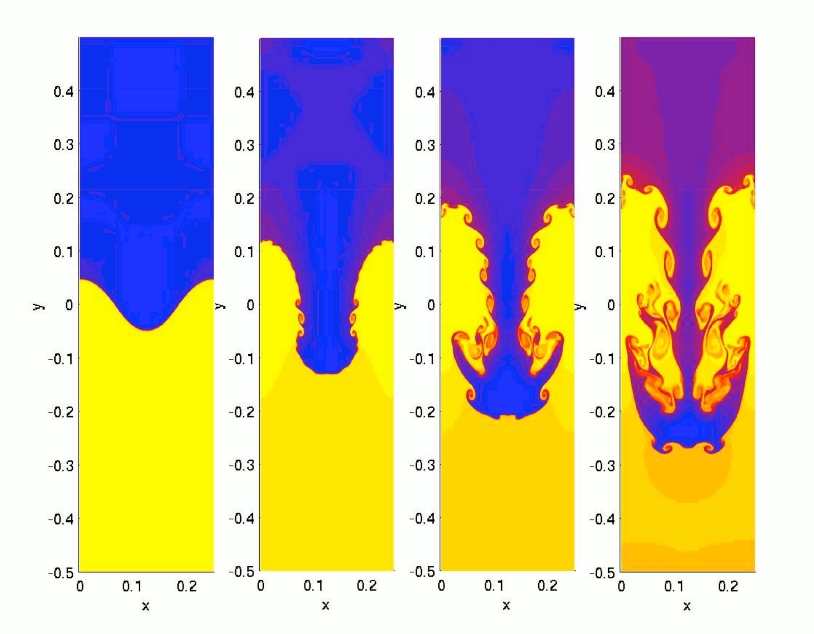
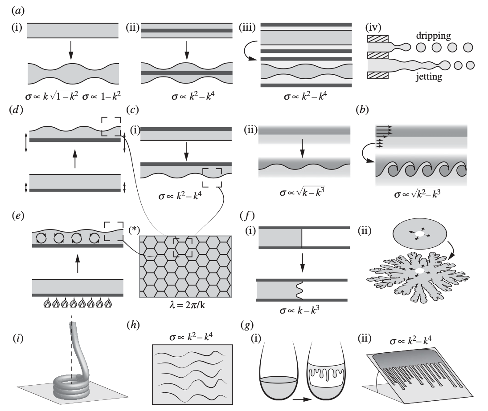

<!-- PDF-EXPORT-IGNORE-START -->
> [!info] 📄 PDF Version
> [Download PDF](./3-Soft-Matter-Instabilities.pdf)
<!-- PDF-EXPORT-IGNORE-END -->

## Lecture 3 — Soft‑matter instabilities

### 0) Why talk about instability?

Patterns are everywhere: dunes and ripples, icicle ribs, dew beads on spider webs, hexagonal cracks in drying mud. Their regularity—despite messy materials—signals robust mechanisms. In fluids (and soft solids), instabilities often set the pattern scale and shape by amplifying tiny disturbances into organized structures. Our goal today is to recognize those mechanisms and the forces that select length and time scales.

---

### 1) Stability in one picture

Think of a bead in a landscape: at the bottom of a well (stable), on a flat shelf (neutral), or on a hilltop (unstable). 

A “standing pencil” fails in practice because the slightest perturbation makes it fall—no physical system is perfectly disturbance‑free. We use this picture to interpret flows: _stable_ states damp disturbances; _unstable_ ones amplify them; _neutral_ ones neither grow nor decay until nonlinearities tip them.

Where do disturbances come from? Ambient vibrations, thermal fluctuations, surface roughness, composition heterogeneity, or imposed forcing (e.g. vibration). Even when continuum hypotheses hold (Knudsen number small), the flow “feels” these small perturbations; if the base state cannot damp them, patterns emerge.

---

### 2) What to identify in any instability

1. Base state: the simplest flow/interface we’d like to hold (a cylinder of liquid, a flat film, two fluids sliding past each other).
2. Competing forces: inertia, viscosity, gravity, surface tension, and sometimes elasticity (soft matter).
3. Positive feedback: does a perturbation increase the driving (pressure, buoyancy, shear) faster than restoring forces (surface tension, viscosity, elasticity) can oppose it?
4. Advection vs absolute growth: disturbances can be swept away while growing (_convective_) or grow in place and contaminate the whole domain (_absolute_). We’ll use this language qualitatively in experiments.
    

Rule of thumb: the same effect (surface tension, elasticity, gravity) that stabilizes short wavelengths often leaves a window of longer wavelengths free to grow—yielding a _most unstable_ wavelength that sets the pattern spacing.

In words of James Clerk Maxwell

---

### 3) Core examples you can recognize in the lab

#### (i) Rayleigh–Plateau (cylindrical thread → droplets)

Mechanism. A small bulge on a liquid thread lowers capillary pressure locally; liquid is drawn from the necks toward the bulge, further enlarging it—positive feedback. Surface tension itself is the _driver_ (seeking to reduce area) yet also damps very short ripples, so a fastest‑growing wavelength emerges and sets droplet spacing. In inviscid limits, that spacing is order‑ten radii (qualitative memory worth keeping).

What to look for. On a dripping faucet, you see the regular drop train because this instability picks a wavelength/time scale of breakup.

Cressey, D. 365 days: Images of the year. Nature 516, 304–309 (2014) - image taken at [Physics of Fluids Department, University of Twente](https://pof.tnw.utwente.nl/).

    <iframe width="560" height="315" src="https://www.youtube-nocookie.com/embed/-DckWNwE7R4?si=zzm8G3ju3MI3qM7p&amp;start=90" 
        title="YouTube video player" frameborder="0" 
        allow="accelerometer; autoplay; clipboard-write; encrypted-media; gyroscope; picture-in-picture; web-share" 
        referrerpolicy="strict-origin-when-cross-origin" allowfullscreen>
    </iframe>

#### (ii) Kelvin–Helmholtz (shear across an interface → billows)

Mechanism. Two fluids sliding past each other create a vorticity sheet at the interface. A ripple tilts that sheet and rolls it up into billows; shear feeding exceeds restoring forces. Surface tension and density contrast stabilize short waves and set a threshold for onset and a preferred scale.

What to look for. In counter‑flowing layers (or the “flag flapping” movie on your slide set), once the interfacial shear is large enough, coherent vortical waves appear and then pair/roll up.

#### (iii) Rayleigh–Taylor (heavy‑over‑light → spikes & bubbles)

Mechanism. Gravity pulls a heavy fluid down through a light one; a downward dent increases the hydrostatic pressure drop there and accelerates further—positive feedback. Surface tension stabilizes short waves; the competition picks a dominant wavelength. Thin‑film variants (heavy film above air) yield honeycomb/hexagonal hole patterns.

Image by Shengtai Li, Hui Li - "Parallel AMR Code for Compressible MHD or HD Equations", Attribution, <a href="https://commons.wikimedia.org/w/index.php?curid=6513545">Link</a>

#### (iv) Faraday waves (vertical vibration → subharmonic surface patterns)

Mechanism. Parametric forcing periodically modulates the effective gravity; the flat surface becomes unstable to standing waves at half the drive frequency. Hexagons/stripes are common near onset. Use this as a canonical example of parametric (not spontaneous) instability and _pattern selection near threshold_.

    <iframe width="560" height="315" src="https://www.youtube-nocookie.com/embed/0d_D6yvXAFo?si=oLZxGjb-EvhSI2Wi" 
        title="YouTube video player" frameborder="0" 
        allow="accelerometer; autoplay; clipboard-write; encrypted-media; gyroscope; picture-in-picture; web-share" 
        referrerpolicy="strict-origin-when-cross-origin" allowfullscreen>
    </iframe>

#### (v) Rayleigh–Bénard–Marangoni (heated film → rolls/hexagons)

Mechanism. Heating from below (buoyancy) or surface‑tension gradients along a free surface (Marangoni) drive cellular convection. Thin layers emphasize Marangoni; thicker ones emphasize buoyancy, flipping flow directions inside the cells. Amplitude/envelope equations near onset rationalize which planforms (rolls, hexagons) persist.

    <iframe width="560" height="315" src="https://www.youtube-nocookie.com/embed/6sW5rWcWfkQ?si=7IoOPp9aYS6_I2a8" 
        title="YouTube video player" frameborder="0" 
        allow="accelerometer; autoplay; clipboard-write; encrypted-media; gyroscope; picture-in-picture; web-share" 
        referrerpolicy="strict-origin-when-cross-origin" allowfullscreen>
    </iframe>

#### (vi) Saffman–Taylor (viscous fingering in Hele‑Shaw cells)

Mechanism. A less viscous fluid pushing a more viscous one creates a pressure‑gradient focusing at finger tips (“tip effect”). Any protrusion experiences larger local pressure gradient and advances faster—runaway growth—while surface tension blunts the tip and limits short waves. Capillary number ($Ca = \eta U/\gamma$) summarizes the competition; channel geometry further selects finger width and number. In radial injection, secondary instabilities (tip‑splitting/side‑branching) govern the branching morphology.

    <iframe width="560" height="315" src="https://www.youtube-nocookie.com/embed/9Flsy0sc_cg?si=n0tpcsNHr-7JgXkG" 
        title="YouTube video player" frameborder="0" 
        allow="accelerometer; autoplay; clipboard-write; encrypted-media; gyroscope; picture-in-picture; web-share" 
        referrerpolicy="strict-origin-when-cross-origin" allowfullscreen>
    </iframe>

#### (vii) Viscous coiling & “fluid mechanical sewing machine”

Mechanism. A falling viscous thread buckles and coils from a balance of gravity, bending, stretching, and surface tension; on a moving belt the contact‑point dynamics introduce memory and rich states (coils, meanders, W‑patterns). Linear stability alone is insufficient—nonlinear, geometry‑driven dynamics dominate far from threshold.

    <iframe width="560" height="315" src="https://www.youtube-nocookie.com/embed/5SpnabbGRQo?si=eUdxJPld0RVSWR_G" 
        title="YouTube video player" frameborder="0" 
        allow="accelerometer; autoplay; clipboard-write; encrypted-media; gyroscope; picture-in-picture; web-share" 
        referrerpolicy="strict-origin-when-cross-origin" allowfullscreen>
    </iframe>

---

### 4) How to “predict” without doing heavy math

- Force balance & scales. Ask which pair of effects compete: inertia vs capillarity (Weber number), viscous vs capillarity (capillary number), inertia vs viscosity (Reynolds number), gravity vs capillarity (Bond number), elasticity vs capillarity (elastocapillary mumber) or inertia in soft materials (elasticity number). These dimensionless groups flag likely instabilities and the direction of selection.
- Dispersion‑curve picture (qualitative). Most interfacial problems have a “bell‑shaped” growth‑rate vs wavelength: short waves stabilized by surface tension/viscosity, long waves limited by the finite driving (e.g. pressure or gravity). The peak sets the emergent spacing observed in your videos/demos. (Keep this as a mental model.)

Sketch of the interfacial instabilities discussed in F. Gallaire & P-T. Brun, Philos. Trans. R. Soc. A, 375:2093, 20160155 (2017). DOI: [10.1098/rsta.2016.0155](https://doi.org/10.1098/rsta.2016.0155)
The dispersion relation, $\sigma$ is the growth rate and $k$ the wave vector, is provided when available. (a(i)–a(iv)) Plateau–Rayleigh instability, (b) Kelvin–Helmoltz instability, (c(i),c(ii)) Rayleigh–Taylor instability in two-phase flows and in a thin layer, (d) Faraday waves arising in a bath subject to periodic oscillatory forcing, (e) Rayleigh–Bénard–Marangoni instability obtained when heating up a thin layer of fluid, (\*) hexagonal tilling, (f(i),f (ii)) plane and radial Saffman–Taylor instability in a Hele–Shaw cell, (g(i),g(ii)) capillary ridge instability and wine tears, (h) Kapitza waves and (i) viscous coiling, with the last three being examples of instabilities found in everyday life. (c(ii)),(d) and (e) typically arrange in patterns such as shown in (\*). Taken from F. Gallaire & P-T. Brun, Philos. Trans. R. Soc. A, 375:2093, 20160155 (2017). DOI: [10.1098/rsta.2016.0155](https://doi.org/10.1098/rsta.2016.0155)

- Convective vs absolute. If a disturbance amplifies but is advected away, we get localized activity; if it grows in place, patterns fill the domain. This informs whether we expect clean, global patterns or drifting, patchy ones in experiments.   

    <iframe width="560" height="315" src="https://www.youtube-nocookie.com/embed/jh5MVUnpMyc?si=wrU4njN7wngA78C1" 
        title="YouTube video player" frameborder="0" 
        allow="accelerometer; autoplay; clipboard-write; encrypted-media; gyroscope; picture-in-picture; web-share" 
        referrerpolicy="strict-origin-when-cross-origin" allowfullscreen>
    </iframe>

---

### 5) From “avoid” to “use”: harnessing instabilities

Engineers used to fear instabilities as failure modes. Soft‑matter physics repurposes them as fabrication tools: microfluidic emulsification (controlled Rayleigh–Plateau), capillarity‑guided assembly of nanopillars (elastocapillary coalescence), and other self‑organization pathways. The mindset shift is to select initial/boundary conditions so the _natural_ instability builds the desired pattern. The inverse problem—choosing those conditions up‑front—is still an open research space. See: P-T. Brun, Shape formation in interfacial flows, Phys. Rev. Fluids, 9:11, 110501 (2024). [DOI: 10.1103/PhysRevFluids.9.110501](https://doi.org/10.1103/PhysRevFluids.9.110501)

> [!significance]- Metadata
> Author:: [Vatsal Sanjay](https://vatsalsanjay.com) 
> Date published:: Oct 30, 2025 
> Date modified:: Oct 30, 2025

> [!link] Back to main website
> [Home](https://comphy-lab.org/), [Team](https://comphy-lab.org/team), [Research](https://comphy-lab.org/research), [Github](https://github.com/comphy-lab)
>
> 📝 [Edit this page on GitHub](https://github.com/comphy-lab/CoMPhy-Lab-Blogs/blob/main/Lecture-Notes/Intro-Soft-Matter/3-Soft-Matter-Instabilities.md)