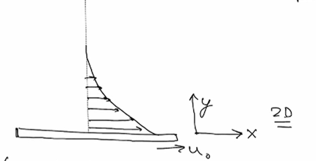
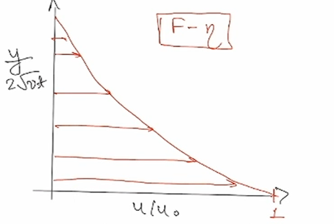

# Stokes' first problem

> [!link] Related lecture material
> This derivation is part of [[2-What-is-Viscosity|Lecture 2: Viscosity and Momentum Diffusion]]

    <iframe width="560" height="315" src="https://www.youtube-nocookie.com/embed/cJWlouRJUNU?si=iWYa8eQIgSscSFBo"
        title="YouTube video player" frameborder="0"
        allow="accelerometer; autoplay; clipboard-write; encrypted-media; gyroscope; picture-in-picture; web-share"
        referrerpolicy="strict-origin-when-cross-origin" allowfullscreen>
    </iframe>

---

## Physical Setup

A semi-infinite fluid initially at rest. At $t=0$, a plate at $y=0$ suddenly moves with velocity $u_0$.

Initial and Boundary Conditions:
$$\begin{align}
\vec{u}(x,y,t=0) &= 0 \\
\text{At } t = 0^{+}, \quad u(y=0) &= u_0
\end{align}$$

---

## Simplifying Assumptions

We assume spatial uniformity in the $x$-direction:

$$\boxed{\frac{\partial()}{\partial x} = 0}$$

Ignoring any initial transients, this leads to:

From continuity equation:
$$\frac{\partial v}{\partial y} = 0$$

Combined with no-slip at the plate:
$$v(y=0) = 0 \quad \Rightarrow \quad v = 0 \quad \text{for all } y$$

---

## Governing Equations

$x$-momentum equation:
$$\rho \frac{\partial u}{\partial t} = - \frac{\partial p}{\partial x} + \mu \frac{\partial^2 u}{\partial y^2}$$

$y$-momentum equation:
$$\frac{\partial p}{\partial y} = 0$$

Pressure gradient: For an open container with $(p,u,v) = 0$ far from the plate:
$$\frac{\partial p}{\partial x} = 0$$

Simplified momentum equation:
$$\boxed{\rho \frac{\partial u}{\partial t} = \mu \frac{\partial^2 u}{\partial y^2}}$$

or equivalently:

$$\boxed{\frac{\partial u}{\partial t} = \nu \frac{\partial^2 u}{\partial y^2}}$$

where $\nu = \mu/\rho$ is the kinematic viscosity.

> [!note] Key Insight
> We cannot directly integrate this PDE as $u = f(y,t)$. We need a more sophisticated approach.

---

## Boundary Conditions

$$\begin{align}
u(y,0) &= 0 \quad \text{(initially at rest)} \\
u(0,t) &= u_0 \quad \text{(plate velocity)} \\
u(\infty,t) &= 0 \quad \text{(far-field BC)}
\end{align}$$

---

## Similarity Solution Approach

Using dimensional analysis, we seek a solution of the form:

$$u = \phi\left(u_0, y, t, \frac{\mu}{\rho} = \nu\right)$$

By dimensional reasoning, the velocity profile should depend on the similarity variable:

$$\frac{u}{u_0} = \phi\left(\frac{y}{\sqrt{\nu t}}\right)$$

> [!important] Similarity Variable
> The characteristic length scale grows as $\sqrt{\nu t}$, reflecting the diffusive nature of momentum transport.

Define the similarity variable:

$$\boxed{\eta = \frac{y}{2\sqrt{\nu t}}}$$

and the dimensionless velocity:

$$\boxed{\frac{u}{u_0} = F(\eta)}$$

---

## Transformation to ODE

We now transform the PDE by computing the necessary derivatives.

### Time derivative:

$$\frac{\partial u}{\partial t} = u_0 \frac{dF}{d\eta} \frac{\partial \eta}{\partial t}$$

where:
$$\frac{\partial \eta}{\partial t} = -\frac{1}{4} \frac{y}{\sqrt{\nu} t^{3/2}} = -\frac{\eta}{2t}$$

Therefore:
$$\frac{\partial u}{\partial t} = u_0 F' \cdot \left(-\frac{\eta}{2t}\right) = \frac{-u_0 F' \eta}{2t}$$

### Spatial derivatives:

$$\frac{\partial u}{\partial y} = u_0 \frac{dF}{d\eta} \frac{\partial \eta}{\partial y} = u_0 F' \frac{1}{2\sqrt{\nu t}}$$

$$\frac{\partial^2 u}{\partial y^2} = u_0 F'' \frac{1}{2\sqrt{\nu t}} \frac{\partial \eta}{\partial y} = \frac{u_0 F''}{4\nu t}$$

### Substituting into the PDE:

$$\frac{-u_0 F' \eta}{2t} = \nu \cdot \frac{u_0 F''}{4\nu t}$$

Simplifying:

$$\boxed{F'' + 2\eta F' = 0}$$

This is an ordinary differential equation for $F(\eta)$.

---

## Transformed Boundary Conditions

The original boundary conditions become:

$$\begin{align}
\eta = \frac{y}{2\sqrt{\nu t}} &\quad \Rightarrow \quad \begin{cases}
t = 0: & \eta \to \infty \\
y \to \infty: & \eta \to \infty \\
y = 0: & \eta = 0
\end{cases}
\end{align}$$

Therefore:
$$\begin{align}
F(\eta \to \infty) &= 0 \\
F(\eta = 0) &= 1
\end{align}$$

---

## Solving the ODE

Starting with:
$$F'' + 2\eta F' = 0$$

Rearrange:
$$\frac{dF'}{d\eta} = -2\eta F'$$

Separate variables:
$$\frac{dF'}{F'} = -2\eta \, d\eta$$

Integrate:
$$\ln(F') = -\eta^2 + C$$

Exponentiate:
$$F' = A e^{-\eta^2}$$

Integrate again:
$$\boxed{F = A \int_0^{\eta} e^{-s^2} \, ds + B}$$

---

## Applying Boundary Conditions

At $\eta = 0$: $F(0) = 1$
$$B = 1$$

As $\eta \to \infty$: $F(\infty) = 0$
$$0 = A \int_0^{\infty} e^{-s^2} \, ds + 1$$

Using the Gaussian integral:
$$\int_0^{\infty} e^{-s^2} \, ds = \frac{\sqrt{\pi}}{2}$$

We get:
$$0 = A \frac{\sqrt{\pi}}{2} + 1 \quad \Rightarrow \quad A = -\frac{2}{\sqrt{\pi}}$$

---

## Final Solution

Substituting the constants:

$$\boxed{F(\eta) = 1 - \frac{2}{\sqrt{\pi}} \int_0^{\eta} e^{-s^2} \, ds}$$

### Error Function Representation

The error function is defined as:
$$\erf(\eta) = \frac{2}{\sqrt{\pi}} \int_0^{\eta} e^{-s^2} \, ds$$

Therefore:

$$\boxed{F(\eta) = 1 - \erf(\eta)}$$

or equivalently, using the complementary error function $\erfc(\eta) = 1 - \erf(\eta)$:

$$\boxed{\frac{u}{u_0} = \erfc\left(\frac{y}{2\sqrt{\nu t}}\right) = 1 - \erf\left(\frac{y}{2\sqrt{\nu t}}\right)}$$

---

## Physical Interpretation

> [!summary] Key Results
>
> 1. Diffusive spreading: The velocity profile spreads into the fluid with a characteristic length scale $\delta(t) \sim \sqrt{\nu t}$
>
> 2. Self-similar evolution: At different times, the velocity profiles collapse onto a single curve when plotted against $\eta = y/(2\sqrt{\nu t})$
>
> 3. Momentum diffusion: The kinematic viscosity $\nu$ acts as a diffusivity for momentum, exactly analogous to thermal or mass diffusion
>
> 4. Penetration depth: At any given time, most of the velocity change occurs within $y \lesssim \sqrt{\nu t}$

The solution demonstrates that viscosity is fundamentally a diffusive process for momentum transport, validating the kinetic theory picture developed in [[2-What-is-Viscosity|Lecture 2]].

![[StokesFirstProblem.pdf]]